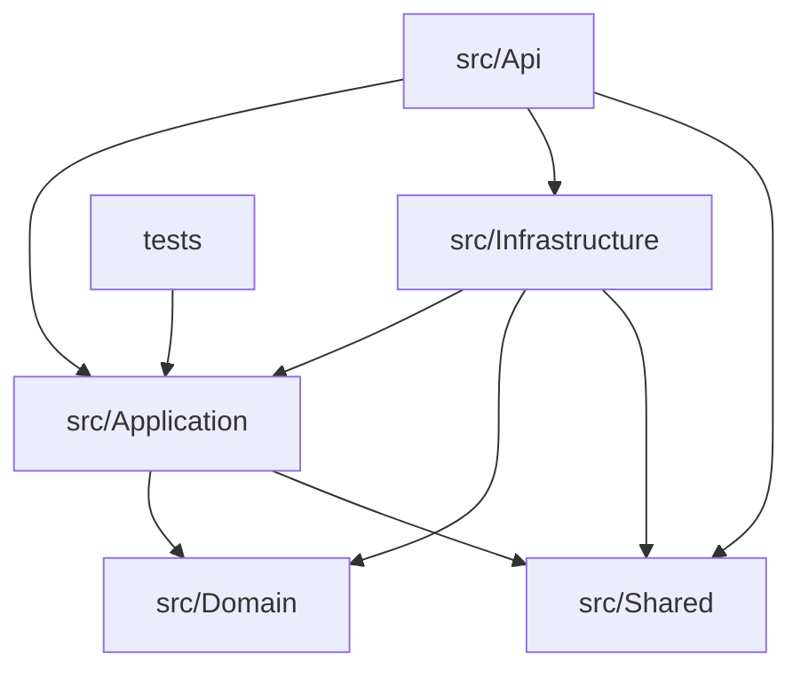

# EcfDgii.Client API & SDK — Dominican Republic Electronic Invoicing (C++)

[](https://en.cppreference.com/w/cpp/20)
[](https://cmake.org/)
[](https://github.com/drogonframework/drogon)
[](https://www.postgresql.org/)
[](LICENSE)

---

**EcfDgii.Client** is an enterprise-grade C++ solution that wraps and exposes the Dominican Republic Tax Authority's (**DGII**) Comprobante Fiscal Electrónico (**e-CF**) REST integration services. Built under **Clean Architecture** and **Domain-Driven Design (DDD)** principles, it provides a robust REST API, secure JWT-based authentication, PostgreSQL persistence with automated auditing and soft-delete, request validation rules, structured logging, and full Docker orchestration support.

---

## Table of Contents

- [Overview](#overview)
- [Key Features](#key-features)
- [Solution Structure](#solution-structure)
- [Installation & Setup](#installation--setup)
- [Dependencies](#dependencies)
- [Basic Configuration](#basic-configuration)
- [Security & JWT Authentication](#security--jwt-authentication)
- [XML Digital Signature (XMLDSig)](#xml-digital-signature-xmldsig)
- [API Endpoints Reference](#api-endpoints-reference)
- [JSON Request & Response Examples](#json-request--response-examples)
- [Database Persistence & Schema](#database-persistence--schema)
- [Complete Core API Interfaces](#complete-core-api-interfaces)
- [Performance Considerations](#performance-considerations)
- [Best Practices](#best-practices)
- [Complete Workflows](#complete-workflows)
- [Docker Orchestration](#docker-orchestration)
- [Continuous Integration](#continuous-integration)
- [Diagnostics & Testing](#diagnostics--testing)
- [License](#license)
- [Contact](#contact)
- [Support](#support)

---

## Overview

The `EcfDgii.Client` solution acts as a middleware between internal billing platforms and the Dominican Republic Tax Authority (DGII) server systems. It automates XML serialization, digital signing (XMLDSig), authentication token acquisition, document transmission, and status querying.

The codebase is split into five cleanly separated layers with a strict dependency direction: the outer layers depend on the inner ones, never the reverse.



### Runtime behavior

> **Auto schema at startup:** on boot the service applies `db/schema.sql` idempotently against the configured PostgreSQL instance.
>
> **Mandatory Authentication:** all endpoints (except `/api/auth/register`, `/api/auth/login` and `/health`) require a valid JWT bearer token.
>
> **Default Admin Credentials:** a default admin user is seeded on first run:
> - **Username:** `admin`
> - **Password:** `AdminPassword123!`

---

## Key Features

### e-CF Operations
- **Single e-CF Sending**: Prepares, validates, signs, and posts signed XML tax receipts directly to DGII REST services.
- **RFCE Summaries**: Automatic validation, serialization, signing, and transmission of Consumption Invoice Summaries (RFCE).
- **DGII Status Syncing**: Queries local and external services to sync transaction statuses (TrackId results) into the PostgreSQL database.
- **Sequence Collision Recovery**: Automatically retries transmitting with a newly acquired sequence number if the DGII responds with a sequence-in-use error.

### Cryptography & Security
- **JWT Authorization**: Protects REST API endpoints with JWT token verification and role policies (`jwt-cpp`, HS256).
- **XMLDSig (RSA-SHA256)**: Digitally signs invoices using enveloped signature transformations with Exclusive C14N (`xmlsec1` + OpenSSL), and validates certificate RNC ownership.
- **Argon2id Password Hashing**: User credentials are stored using libsodium's `crypto_pwhash` (salted, adaptive).
- **Auditing & Tracking**: Automatically registers creation, update, and soft-deletion dates/users for all tables.

### Enterprise Observability
- **Structured Logging**: Request start/completion and error logging with elapsed timings via `spdlog`.
- **RFC 9457 ProblemDetails**: A global exception handler formats validation and runtime errors as `application/problem+json`.
- **Health Endpoint**: `/health` for liveness/readiness probes.

---

## Solution Structure

```text
src/
├── Domain/              # Enterprise core: entities, value objects, exceptions, abstractions
│   ├── Common/          # AuditableEntity base model
│   ├── Entities/        # User, Customer, EcfDocument, Rfce, ResponseModels, EcfClientOptions
│   ├── Interfaces/      # Abstractions (IEcfClient, IEcfXmlSerializer, repositories, security)
│   └── Exceptions/      # Domain-specific exceptions (EcfSigningException, EcfValidationException)
├── Application/         # Application use cases, request handlers, validation rules
│   ├── Common/          # Logging & validation behaviors, ValidationException, request validators
│   ├── Customers/       # Customer CRUD handlers + DTOs
│   ├── Ecf/             # SendEcf, SendRfce, and GetStatus handlers + DTOs
│   ├── Auth/            # Authentication use cases + DTOs
│   └── Services/        # EcfValidator, PollingHelper
├── Infrastructure/      # Concrete implementations, DB access, DGII REST client
│   ├── Persistence/     # DbContext, repositories, schema bootstrap, sequence provider
│   ├── Security/        # PasswordHasher, TokenService, EcfXmlSigner, EcfSecurityUtils
│   ├── Serialization/   # EcfXmlSerializer
│   └── Dgii/            # DgiiDirectTransport, EcfTokenManager, EcfEnvironmentConfig
├── Shared/              # Result<T> wrapper, cross-cutting helpers
└── Api/                 # Drogon host, controllers, filters, composition root
db/schema.sql            # PostgreSQL schema (applied at startup)
config/appsettings.json  # Runtime configuration
tests/                   # Unit tests
```

---

## Installation & Setup

### Prerequisites
- CMake ≥ 3.20 and a C++20 compiler (MSVC 2022 / GCC 12+ / Clang 15+)
- [Ninja](https://ninja-build.org/)
- [vcpkg](https://github.com/microsoft/vcpkg) with the `VCPKG_ROOT` environment variable set
- A reachable PostgreSQL instance

### Method 1: Manual Build

1. Clone the repository:
   ```bash
   git clone https://github.com/JorgeGBeltre/EcfDgi.Client.git
   cd EcfDgi.Client
   ```
2. Configure and build (vcpkg resolves all dependencies from `vcpkg.json`):
   ```bash
   cmake --preset default
   cmake --build build --target ecfdgii_api
   ```
3. Start the API:
   ```bash
   cd build
   ./ecfdgii_api
   ```

The build copies `appsettings.json` and `db/schema.sql` next to the produced binary.

### Method 2: Docker Compose Run

1. Run the entire database and API stack:
   ```bash
   docker compose up --build -d
   ```
2. Verify execution using the docker logs:
   ```bash
   docker logs ecf_dgii_api_cpp -f
   ```

---

## Dependencies

Dependencies are declared in `vcpkg.json` and resolved automatically during configuration.

```jsonc
{
  "dependencies": [
    "drogon",         // HTTP server framework (controllers, routing, filters)
    "cpr",            // HTTP client for outbound DGII calls (libcurl)
    "libxml2",        // XML building and parsing
    { "name": "xmlsec", "features": ["openssl"] }, // XMLDSig signing
    "openssl",        // SHA-256, PKCS#12, X.509, RSA
    "nlohmann-json",  // JSON (core)
    "jwt-cpp",        // JWT generation & validation (HS256)
    "libpqxx",        // PostgreSQL client
    "libsodium",      // Argon2id password hashing
    "spdlog"          // Structured logging
  ]
}
```

---

## Basic Configuration

The composition root (`AppServices`) wires the application and infrastructure services and builds a per-request scope (database context + repositories + unit of work).

### Complete `appsettings.json` Template

Configure your server, database, credentials, and signing certificate in `config/appsettings.json`:

```json
{
  "Server": { "Host": "0.0.0.0", "Port": 8080, "Threads": 0 },
  "ConnectionStrings": {
    "DefaultConnection": "host=localhost port=5432 dbname=ecf_dgii user=postgres password=postgres"
  },
  "JwtSettings": {
    "Secret": "e_CF_Dominican_Tax_Authority_Secure_JWT_Secret_Token_2026_Key_Length_Minimum_32_Bytes!",
    "ExpirationMinutes": 60,
    "Issuer": "EcfDgiiClientIssuer",
    "Audience": "EcfDgiiClientAudience"
  },
  "EcfClientOptions": {
    "ApiKey": "",
    "BaseUrl": "https://ecf.dgii.gov.do",
    "Environment": "Test",
    "Mode": "DgiiDirect",
    "RncEmisor": "101672919",
    "CertificatePath": "C:/config/credentials/dgii_certificate.p12",
    "CertificatePassword": "SecurePassword123",
    "AutoRetryOnReuseableSequence": true
  }
}
```

The connection string uses the libpq keyword/value format. The `ConnectionStrings__DefaultConnection` environment variable overrides the file value.

---

## Security & JWT Authentication

Endpoints are protected by a Drogon request filter (`JwtAuthFilter`) that validates the `Authorization: Bearer <token>` header. Validation checks the signing key, issuer and audience, then stashes the user claims (`nameid`, `name`, `role`) on the request for downstream use. A second filter (`AdminRoleFilter`) enforces role-based authorization on privileged routes.

```cpp
// JwtAuthFilter.cpp — token validation with jwt-cpp
auto decoded = jwt::decode(token);
auto verifier = jwt::verify()
    .allow_algorithm(jwt::algorithm::hs256{ jwtCfg.secret })
    .with_issuer(jwtCfg.issuer)
    .with_audience(jwtCfg.audience);
verifier.verify(decoded);   // throws if invalid/expired

req->attributes()->insert("userId",   decoded.get_payload_claim("nameid").as_string());
req->attributes()->insert("username", decoded.get_payload_claim("name").as_string());
req->attributes()->insert("role",     decoded.get_payload_claim("role").as_string());
```

Tokens are issued on register/login by `TokenService::generateToken`, embedding the user id, username, email and role claims with the configured issuer, audience and expiry.

---

## XML Digital Signature (XMLDSig)

The cryptographic signature of XML receipts is handled by the `EcfXmlSigner` service. It loads the private key from the client PKCS#12 certificate, validates that the certificate subject matches the sender's RNC, builds an enveloped signature template (Exclusive C14N + RSA-SHA256), computes the signature and appends the `<Signature>` block.

```cpp
// EcfXmlSigner.cpp — enveloped XMLDSig (Exclusive C14N + RSA-SHA256)
std::string EcfXmlSigner::signXml(const std::string& xmlContent,
                                  const std::string& rncEmisor) {
    if (!validateCertificateSn(rncEmisor))
        throw EcfSigningException(
            "El RNC del certificado no coincide con el emisor: " + rncEmisor);

    xmlDocPtr doc = xmlReadMemory(xmlContent.c_str(), (int)xmlContent.size(),
                                  "doc.xml", nullptr, 0);

    xmlNodePtr signNode = xmlSecTmplSignatureCreate(
        doc, xmlSecTransformExclC14NId, xmlSecTransformRsaSha256Id, nullptr);

    xmlNodePtr ref = xmlSecTmplSignatureAddReference(
        signNode, xmlSecTransformSha256Id, nullptr, (const xmlChar*)"", nullptr);
    xmlSecTmplReferenceAddTransform(ref, xmlSecTransformEnvelopedId);
    xmlSecTmplReferenceAddTransform(ref, xmlSecTransformExclC14NId);

    xmlNodePtr keyInfo = xmlSecTmplSignatureEnsureKeyInfo(signNode, nullptr);
    xmlSecTmplKeyInfoAddX509Data(keyInfo);

    xmlAddChild(xmlDocGetRootElement(doc), signNode);   // enveloped

    xmlSecKeyPtr key = xmlSecCryptoAppKeyLoadMemory(
        pfxBytes_.data(), pfxBytes_.size(), xmlSecKeyDataFormatPkcs12,
        pfxPassword_.c_str(), nullptr, nullptr);

    xmlSecDSigCtxPtr ctx = xmlSecDSigCtxCreate(nullptr);
    ctx->signKey = key;
    xmlSecDSigCtxSign(ctx, signNode);
    // ... serialize doc and return
}
```

The e-CF security code is derived by `EcfSecurityUtils::calcularCodigoSeguridad`, which extracts the `<SignatureValue>`, computes its SHA-256 and takes the first 6 hex characters.

---

## API Endpoints Reference

All endpoints except `Auth` and `/health` require a valid JWT Bearer header: `Authorization: Bearer <your-token>`.

| Route | Method | Authentication | Request Body | Description |
| :--- | :--- | :--- | :--- | :--- |
| `/api/auth/register` | `POST` | Anonymous | `RegisterUserCommand` | Creates a new user |
| `/api/auth/login` | `POST` | Anonymous | `LoginUserCommand` | Verifies user password and yields a JWT token |
| `/api/customers` | `GET` | Bearer Token | None | Returns a list of active customers |
| `/api/customers/{id}` | `GET` | Bearer Token | None | Retrieves a customer by ID |
| `/api/customers` | `POST` | Bearer Token | `CreateCustomerCommand` | Creates a new customer record |
| `/api/customers/{id}` | `PUT` | Bearer Token | `UpdateCustomerCommand` | Updates an existing customer record |
| `/api/customers/{id}` | `DELETE` | Admin Role | None | Soft-deletes a customer |
| `/api/ecf/send` | `POST` | Bearer Token | `SendEcfCommand` | Signs and sends an XML e-CF document |
| `/api/ecf/send-rfce` | `POST` | Bearer Token | `SendRfceCommand` | Signs and sends a Consumption Summary |
| `/api/ecf/status` | `GET` | Bearer Token | Query Parameters | Queries current processing status |
| `/health` | `GET` | Anonymous | None | Liveness probe |

---

## JSON Request & Response Examples

### 1. User Registration (`POST /api/auth/register`)

**Request Payload:**
```json
{
  "username": "jorge_admin",
  "email": "jorge@domain.com",
  "password": "SecurePassword123!",
  "role": "Admin"
}
```

**Response Payload (200 OK):**
```json
{
  "username": "jorge_admin",
  "token": "eyJhbGciOiJIUzI1NiIsInR5cCI6IkpXVCJ9...",
  "role": "Admin"
}
```

### 2. User Login (`POST /api/auth/login`)

**Request Payload:**
```json
{
  "username": "jorge_admin",
  "password": "SecurePassword123!"
}
```

**Response Payload (200 OK):**
```json
{
  "username": "jorge_admin",
  "token": "eyJhbGciOiJIUzI1NiIsInR5cCI6IkpXVCJ9...",
  "role": "Admin"
}
```

### 3. Send e-CF invoice (`POST /api/ecf/send`)

**Request Payload:**
```json
{
  "xmlContent": "<eCF xmlns=\"http://dgii.gov.do/eCF\">...</eCF>",
  "fileName": "101672919E3100000001.xml",
  "rncEmisor": "101672919",
  "eNcf": "E310000000001",
  "rncComprador": "22400013743",
  "totalAmount": 1180.00,
  "itbisAmount": 180.00
}
```

**Response Payload (200 OK):**
```json
{
  "trackId": "d748f219-c0ad-4d43-9878-837cc21087ab",
  "error": null,
  "mensaje": "e-CF recibido exitosamente"
}
```

---

## Database Persistence & Schema

Column names use the database `snake_case` convention. The `DbContext` intercepts entity mutations to stamp auditing columns (`created_at`/`created_by`, `updated_at`/`updated_by`) and turns deletes into soft deletes (`is_deleted = true`, `deleted_at`, `deleted_by`). Read queries transparently filter out soft-deleted rows.

```sql
-- db/schema.sql (excerpt)
CREATE TABLE IF NOT EXISTS customers (
    id         uuid PRIMARY KEY,
    name       varchar(200) NOT NULL,
    email      varchar(150),
    rnc        varchar(20)  NOT NULL,
    created_at timestamptz  NOT NULL,
    created_by varchar(100),
    updated_at timestamptz,
    updated_by varchar(100),
    deleted_at timestamptz,
    deleted_by varchar(100),
    is_deleted boolean      NOT NULL DEFAULT false
);

CREATE INDEX IF NOT EXISTS ix_customers_rnc ON customers (rnc);
```

The schema is applied idempotently at startup by `DbInitializer`, which also seeds the default admin user and the "Consumidor Final Genérico" customer if they are not present.

---

## Complete Core API Interfaces

These abstractions separate use cases in the Application layer from concrete implementations in the Infrastructure layer.

```cpp
// IEcfClient.h
namespace ecf::domain {
class IEcfClient {
public:
    virtual ~IEcfClient() = default;
    virtual EcfRecepcionResponse sendEcf(const std::string& xmlContent,
                                         const std::string& fileName) = 0;
    virtual RfceRecepcionResponse sendRfce(Rfce& rfce) = 0;
    virtual ConsultaResultadoResponse consultarResultado(const std::string& trackId) = 0;
    virtual ConsultaEstadoResponse consultarEstado(
        const std::string& rncEmisor, const std::string& eNcf,
        const std::optional<std::string>& rncComprador = std::nullopt,
        const std::optional<std::string>& codigoSeguridad = std::nullopt) = 0;
    virtual std::vector<TrackIdDetalle> consultarTrackIds(const std::string& rncEmisor,
                                                          const std::string& eNcf) = 0;
    virtual RfceConsultaResponse consultarRfce(const std::string& rncEmisor,
                                               const std::string& eNcf,
                                               const std::string& codigoSeguridad) = 0;
    virtual TimbreResponse   validarTimbreEcf(const TimbreEcfRequest& request) = 0;
    virtual TimbreFcResponse validarTimbreFc(const TimbreFcRequest& request) = 0;
    virtual std::vector<DirectorioContribuyente> consultarDirectorio() = 0;
    virtual std::vector<EstatusServicio>         consultarEstatusServicios() = 0;
    virtual std::vector<VentanaMantenimiento>    consultarVentanasMantenimiento() = 0;
    virtual std::string      verificarEstadoAmbiente(AmbienteEnum ambiente) = 0;
    virtual AnulacionResponse anularRangos(const std::string& xmlContent) = 0;
};
}  // namespace ecf::domain

// IEcfXmlSerializer.h
namespace ecf::domain {
class IEcfXmlSerializer {
public:
    virtual ~IEcfXmlSerializer() = default;
    virtual std::string serialize(const Rfce& model) = 0;
    virtual EcfRecepcionResponse      deserializeEcfRecepcion(const std::string& xml) = 0;
    virtual RfceRecepcionResponse     deserializeRfceRecepcion(const std::string& xml) = 0;
    virtual ConsultaResultadoResponse deserializeConsultaResultado(const std::string& xml) = 0;
    virtual std::string getFileName(const std::string& rncEmisor, const std::string& eNcf) = 0;
    virtual std::string escapeAlfanum(const std::string& value) = 0;
};
}  // namespace ecf::domain

// IEcfSequenceProvider.h
namespace ecf::domain {
class IEcfSequenceProvider {
public:
    virtual ~IEcfSequenceProvider() = default;
    virtual std::string getNext(const std::string& rncEmisor) = 0;
    virtual void release(const std::string& rncEmisor, const std::string& eNcf) = 0;
};
}  // namespace ecf::domain
```

---

## Performance Considerations

- **Threaded HTTP server**: Drogon serves requests across a configurable worker-thread pool (`Server.Threads`, `0` = hardware concurrency).
- **Cached DGII token**: `EcfTokenManager` caches the bearer token and only renews it ~5 minutes before expiry, guarded by a mutex.
- **Scoped database connections**: each request builds its own scope; mutations are staged and committed atomically by the unit of work in a single transaction.
- **Reused serializer/signer**: XML serialization and the signing context are initialized once and reused to avoid repeated setup costs.

---

## Best Practices

1. **Use HTTPS and TLS 1.2/1.3**: Ensure connections to the API and to DGII endpoints are strictly encrypted.
2. **Store P12/PFX Certificates Safely**: Keep the signing certificate out of public folders; rely on secure configuration or secret stores (AWS Secrets Manager / Azure Key Vault).
3. **Keep the JWT secret private**: Use a long, random secret (≥ 32 bytes) and inject it via environment/secret configuration in production.
4. **Rely on the global error handler**: Validation errors are surfaced as RFC 9457 `problem+json`, preventing internal details from leaking to clients.

---

## Complete Workflows

### Successful e-CF Invoice Submission Workflow

```
Client App                   EcfDgii.Client API              DGII Gateway
   │                                 │                             │
   │── POST /api/ecf/send ──────────►│                             │
   │   (JWT authentication check)    │── 1. Sign XML (XMLDSig)     │
   │                                 │── 2. Authenticate token     │
   │                                 │── 3. Post payload ─────────►│
   │                                 │◄── 4. Return TrackId ───────│
   │                                 │                             │
   │                                 │── 5. Save to local Database │
   │◄── Return TrackId ──────────────│                             │
```

### e-CF Sequence Reuse Auto-Retry Workflow

```
Application Handler          EcfClient Service              DGII Gateway
   │                                 │                             │
   │── sendRfce ────────────────────►│                             │
   │                                 │── Send to DGII ────────────►│
   │                                 │◄── Rejected (Sequence Used)─│
   │                                 │                             │
   │                                 │── 1. Get next sequence      │
   │                                 │── 2. Re-sign XML payload    │
   │                                 │── 3. Resend payload ───────►│
   │                                 │◄── Accepted (Success) ──────│
   │◄── Return Success ──────────────│                             │
```

---

## Docker Orchestration

The API stack uses Docker Compose, linking the REST API container and a PostgreSQL database.

### Dockerfile (`./Dockerfile`)

```dockerfile
FROM ubuntu:24.04 AS build
RUN apt-get update && apt-get install -y --no-install-recommends \
    git curl zip unzip tar ca-certificates \
    build-essential cmake ninja-build pkg-config \
    autoconf automake libtool python3
ENV VCPKG_ROOT=/opt/vcpkg
RUN git clone https://github.com/microsoft/vcpkg "$VCPKG_ROOT" \
 && "$VCPKG_ROOT/bootstrap-vcpkg.sh" -disableMetrics
WORKDIR /src
COPY . .
RUN cmake --preset default && cmake --build build --target ecfdgii_api

FROM ubuntu:24.04 AS final
RUN apt-get update && apt-get install -y --no-install-recommends ca-certificates libpq5
WORKDIR /app
COPY --from=build /src/build/ecfdgii_api /app/ecfdgii_api
COPY --from=build /src/config/appsettings.json /app/appsettings.json
COPY --from=build /src/db/schema.sql /app/db/schema.sql
EXPOSE 8080
ENTRYPOINT ["/app/ecfdgii_api"]
```

### Docker Compose (`./docker-compose.yml`)

```yaml
services:
  postgres:
    image: postgres:15-alpine
    container_name: ecf_dgii_postgres_cpp
    environment:
      POSTGRES_DB: ecf_dgii
      POSTGRES_USER: postgres
      POSTGRES_PASSWORD: postgres
    ports:
      - "5432:5432"
    volumes:
      - postgres_data:/var/lib/postgresql/data

  api:
    build:
      context: .
      dockerfile: Dockerfile
    container_name: ecf_dgii_api_cpp
    ports:
      - "8080:8080"
    environment:
      - ConnectionStrings__DefaultConnection=host=postgres port=5432 dbname=ecf_dgii user=postgres password=postgres
    depends_on:
      - postgres

volumes:
  postgres_data:
```

---

## Continuous Integration

A GitHub Actions pipeline at `.github/workflows/ci.yml` runs on every push to `develop` in three stages:

1. **test** — builds the project on Ubuntu with CMake + vcpkg (cached vcpkg tree) and runs the suite via `ctest`.
2. **merge-to-main** — once tests pass, fast-forward merges `develop` into `main` and pushes it.
3. **docker** — builds the Docker image from `main` (`ecfdgii-client-cpp:latest`).

```bash
# Reproduce the test stage locally
cmake --preset default -DECF_BUILD_TESTS=ON
cmake --build build --parallel
ctest --test-dir build --output-on-failure
```

### Required repository secrets

| Secret | Purpose |
| :--- | :--- |
| `AUTO_MERGE_TOKEN` | Token with push rights for the `develop` → `main` merge (falls back to `GITHUB_TOKEN`) |

---

## Diagnostics & Testing

### Running Tests
Enable and run the test target:

```bash
cmake --preset default -DECF_BUILD_TESTS=ON
cmake --build build --target validator_tests
ctest --test-dir build --output-on-failure
```

### Health Check Endpoint
Check API status by requesting the `/health` endpoint:

**Example Request:**
```bash
curl http://localhost:8080/health
```

**Example Response:**
```json
{
  "status": "Healthy"
}
```

---

## License

Licensed under the **MIT License**. See [LICENSE](LICENSE) for details.

---

## Contact

Author: **Jorge Gaspar Beltre Rivera**  
Project: **EcfDgii.Client API & SDK (C++)**

 [](https://github.com/JorgeGBeltre)
 [](https://www.linkedin.com/in/jorge-gaspar-beltre-rivera/)
 [](mailto:Jorgegaspar3021@gmail.com)

---

## Support

This project is developed independently.

Even a small contribution helps dedicate more time to development, testing, and releasing new features.

 [](https://www.paypal.com/donate/?hosted_button_id=2VLA8BWT967LU)
