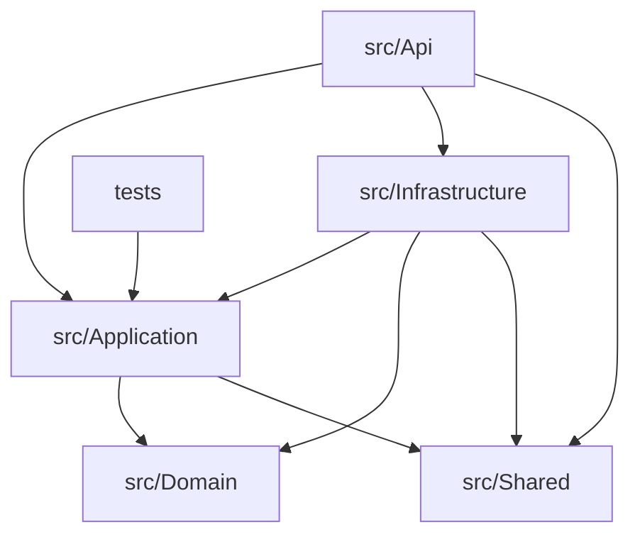
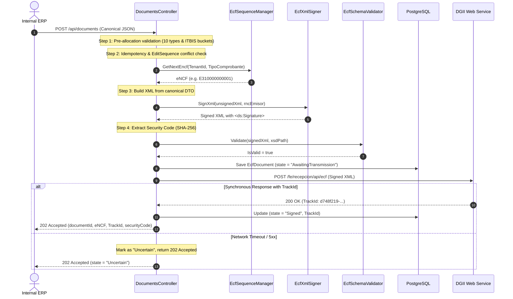
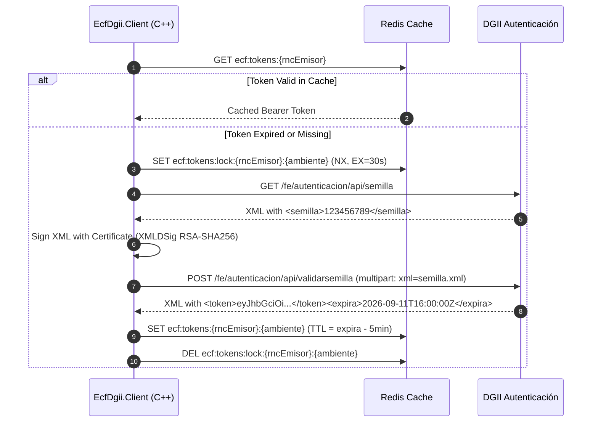
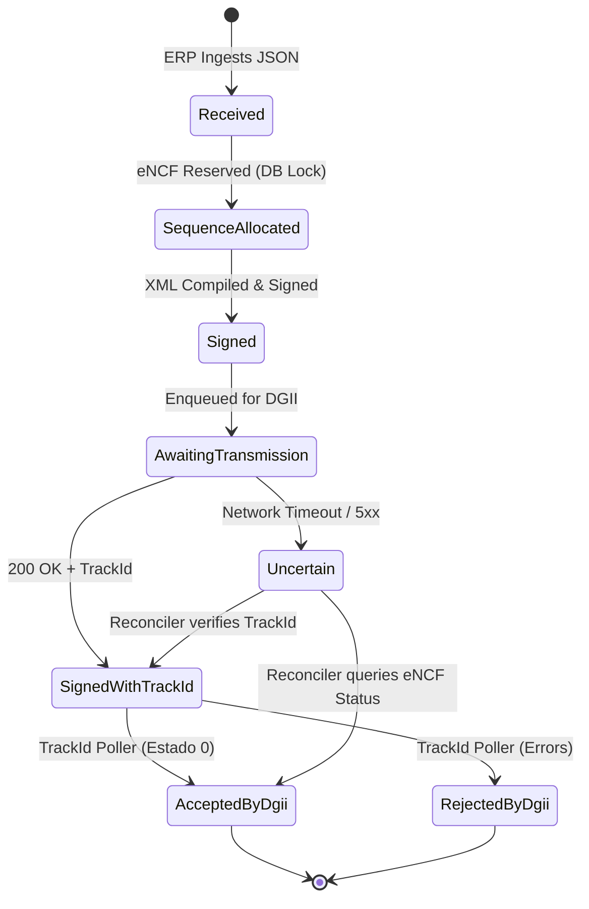
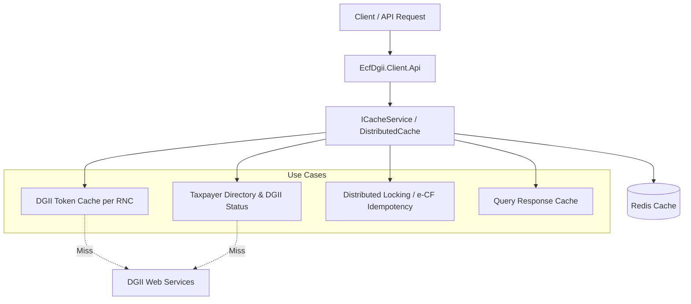

# EcfDgii.Client API & SDK — Dominican Republic Electronic Invoicing (C++)

[](https://en.cppreference.com/w/cpp/20)
[](https://cmake.org/)
[](https://github.com/drogonframework/drogon)
[](https://redis.io/)
[](https://www.postgresql.org/)
[](LICENSE)
[](https://deepwiki.com/JorgeGBeltre/EcfDgi.Client_C_Plus_Plus)

---

**EcfDgii.Client** is an enterprise-grade C++ solution that wraps and exposes the Dominican Republic Tax Authority's (**DGII**) Comprobante Fiscal Electrónico (**e-CF**) REST integration services. Built under **Clean Architecture** and **Domain-Driven Design (DDD)** principles, it provides 100% functional parity with the reference C# client while delivering native C++ speed, ultra-low latency, and massive concurrency handling.

It features complete support for all 10 canonical e-CF types (invoices, credit/debit notes, purchase bills, minor expenses, exports, etc.), digital signature generation (W3C XMLDSig RSA-SHA256 with C14N), local multithreaded XSD schema validation via `libxml2`, B2B reception and commercial approval (`ARECF` / `ACECF`), robust state machine with idempotency and race condition recovery, dual JWT and HMAC worker authentication, distributed Redis token management, and background status reconciliation.

---

## Table of Contents

- [Overview](#overview)
- [Key Features](#key-features)
- [Solution Structure](#solution-structure)
- [How the C++ DGII Client Works (Detailed Technical Replication Guide)](#how-the-c-dgii-client-works-detailed-technical-replication-guide)
  - [1. Canonical ERP Ingestion & Type Guards](#1-canonical-erp-ingestion--type-guards)
  - [2. Sequence Allocation & Concurrency Control](#2-sequence-allocation--concurrency-control)
  - [3. XML Compilation & Element Structure](#3-xml-compilation--element-structure)
  - [4. XMLDSig Digital Signature & In-Memory Fallback](#4-xmldsig-digital-signature--in-memory-fallback)
  - [5. Security Code Calculation (SHA-256)](#5-security-code-calculation-sha-256)
  - [6. Local XSD Schema Validation Gate](#6-local-xsd-schema-validation-gate)
  - [7. How Invoices, Credit Notes, and Bills Reach the DGII (Wire Protocol & Data Flow)](#7-how-invoices-credit-notes-and-bills-reach-the-dgii-wire-protocol--data-flow)
  - [8. State Machine & Asynchronous Status Polling](#8-state-machine--asynchronous-status-polling)
  - [9. B2B Vendor Invoicing Exchange (ARECF & ACECF)](#9-b2b-vendor-invoicing-exchange-arecf--acecf)
  - [10. Background Status Reconciliation Thread](#10-background-status-reconciliation-thread)
- [Complete Inventory of Completed Functions & Endpoints](#complete-inventory-of-completed-functions--endpoints)
- [JSON Payloads & Signed XML Examples](#json-payloads--signed-xml-examples)
  - [Example A: Tax Credit Invoice (Tipo 31 - Factura de Crédito Fiscal)](#example-a-tax-credit-invoice-tipo-31---factura-de-crédito-fiscal)
  - [Example B: Credit Note (Tipo 34 - Nota de Crédito)](#example-b-credit-note-tipo-34---nota-de-crédito)
  - [Example C: Debit Note (Tipo 33 - Nota de Débito)](#example-c-debit-note-tipo-33---nota-de-débito)
  - [Example D: Purchase Bill (Tipo 41 - Compras / Retenciones)](#example-d-purchase-bill-tipo-41---compras--retenciones)
  - [Example E: Consumption Invoice (Tipo 32 - Factura de Consumo)](#example-e-consumption-invoice-tipo-32---factura-de-consumo)
  - [Example E2: Consumer Invoice Summary (RFCE 32 - Resumen de Factura de Consumo)](#example-e2-consumer-invoice-summary-rfce-32---resumen-de-factura-de-consumo)
  - [Example F: B2B Reception Acknowledgment (ARECF XML)](#example-f-b2b-reception-acknowledgment-arecf-xml)
  - [Example G: B2B Commercial Approval (ACECF XML)](#example-g-b2b-commercial-approval-acecf-xml)
  - [Example H: DGII Seed Authentication Handshake (Semilla & Token XML)](#example-h-dgii-seed-authentication-handshake-semilla--token-xml)
- [Installation & Setup](#installation--setup)
- [Dependencies](#dependencies)
- [Basic Configuration](#basic-configuration)
- [Distributed Caching & Redis Integration](#distributed-caching--redis-integration)
- [Redis Integration Architecture](#redis-integration-architecture)
- [Interactive API Documentation (Scalar & Swagger)](#interactive-api-documentation-scalar--swagger)
- [Security & Dual Authentication (JWT & HMAC)](#security--dual-authentication-jwt--hmac)
- [API Endpoints Reference](#api-endpoints-reference)
- [Database Persistence & Schema](#database-persistence--schema)
- [Complete Core API Interfaces](#complete-core-api-interfaces)
- [Performance Considerations](#performance-considerations)
- [Best Practices](#best-practices)
- [Complete Workflows](#complete-workflows)
- [Docker Orchestration](#docker-orchestration)
- [Continuous Integration](#continuous-integration)
- [Diagnostics & Testing](#diagnostics--testing)
- [License](#license)
- [Contact](#contact)
- [Support](#support)

---

## Overview

The `EcfDgii.Client` solution acts as a middleware between internal billing/ERP platforms and the Dominican Republic Tax Authority (DGII) server systems. It automates canonical validation, sequence allocation, XML serialization, digital signing (XMLDSig), local XSD schema verification, authentication token acquisition, document transmission, status querying, B2B reception, and response caching.

The codebase is split into five cleanly separated layers with a strict dependency direction: the outer layers depend on the inner ones, never the reverse.


```mermaid
graph TD
    Api[src/Api] --> Application[src/Application]
    Api --> Infrastructure[src/Infrastructure]
    Api --> Shared[src/Shared]
    Infrastructure --> Application
    Infrastructure --> Domain[src/Domain]
    Infrastructure --> Shared
    Application --> Domain
    Application --> Shared
    tests --> Application
```

### Runtime Behavior

> **Auto schema at startup:** on boot the service applies `db/schema.sql` idempotently against the configured PostgreSQL instance.
>
> **Mandatory Authentication:** all business endpoints require either a valid JWT bearer token or a valid Worker HMAC-SHA256 signature header.
>
> **Interactive Documentation:** open [http://localhost:8080/scalar](http://localhost:8080/scalar) or [http://localhost:8080/swagger](http://localhost:8080/swagger) to view interactive API docs.
>
> **Default Admin Credentials:** a default admin user is seeded on first run:
> - **Username:** `admin`
> - **Password:** `AdminPassword123!`

---

## Key Features

### e-CF Operations & Caching
- **Canonical ERP Ingestion (`POST /api/documents`)**: Accepts canonical JSON invoices and performs pre-allocation business validations for all 10 e-CF types before reserving sequence numbers.
- **Full Type Spectrum**: Pre-allocation validations for:
  - `31`: Factura de Crédito Fiscal (mandatory buyer identification).
  - `32`: Factura de Consumo ($\ge 250,000$ DOP buyer identification rule).
  - `33`: Nota de Débito (mandatory reference to modified eNCF and modification code).
  - `34`: Nota de Crédito (mandatory reference to modified eNCF and modification code).
  - `41`: Compras (mandatory ITBIS and/or ISR withholding block).
  - `43`: Gastos Menores (strict zero fiscal credit enforcement).
  - `44`: Regímenes Especiales (buyer identification & exemption rules).
  - `45`: Gubernamental (government entity buyer verification).
  - `46`: Exportaciones (ISO 3166-1 alpha-2 destination country & foreign currency).
  - `47`: Pagos al Exterior (foreign payee tax withholding).
- **Single e-CF Sending (`POST /api/ecf/send`)**: Prepares, validates, signs, and posts pre-built XML tax receipts directly to DGII REST services.
- **RFCE Summaries (`POST /api/ecf/send-rfce`)**: Automatic validation, serialization, signing, and transmission of Consumption Invoice Summaries (RFCE).
- **DGII Status Syncing (`GET /api/ecf/status`)**: Queries local and external services to sync transaction statuses (TrackId results) into the PostgreSQL database.
- **Sequence Collision Recovery**: Automatically retries transmitting with a newly acquired sequence number if the DGII responds with a sequence-in-use error.
- **B2B Receptor Exchange**: Endpoints for vendor e-CF reception (`/fe/recepcion/api/ecf`), producing signed `ARECF` acknowledgments, commercial approval (`/fe/aprobacioncomercial/api/ecf`), and mutual seed authentication (`/fe/autenticacion/api/semilla` and `/validacioncertificado`).
- **Redis & Decorator Caching (`CachedEcfClient`)**: Caches taxpayer directories (24h), service status (5m), and maintenance windows (1h) with graceful in-memory fallback.
- **Distributed Token Lock**: `EcfTokenManager` uses Redis distributed locks (`ecf:tokens:lock:{rnc}`) and token caching (`ecf:tokens:{rnc}`) to prevent token request thundering herds across distributed nodes.

### Cryptography & Security
- **Dual Authorization (JWT & Worker HMAC)**: Protects REST API endpoints with either JWT bearer tokens or machine-to-machine HMAC-SHA256 headers (`X-Worker-Key-Id`, `X-Request-Timestamp`, `X-Request-Nonce`, `X-Request-Signature`).
- **XMLDSig (RSA-SHA256)**: Digitally signs invoices using enveloped signature transformations with Exclusive C14N (`xmlsec1` + OpenSSL), and validates certificate RNC ownership.
- **Zero-Config Fallback Certificate**: Auto-generates self-signed X.509 certificates in memory when no physical certificate is configured, allowing instant test execution without blocking.
- **Security Code Calculation**: Computes SHA-256 over `<ds:SignatureValue>` to derive the 6-character security code for invoice printing and QR verification.
- **Local XSD Schema Gate**: Automatically matches and validates signed documents against 15 bundled official DGII XSD schemas using `libxml2` with multithreaded caching.
- **Argon2id Password Hashing**: User credentials are stored using libsodium's `crypto_pwhash` (salted, adaptive).
- **Auditing & Tracking**: Automatically registers creation, update, and soft-deletion dates/users for all tables.

### Enterprise Observability & Documentation
- **Scalar API Reference & Swagger UI**: Built-in interactive API documentation interfaces served at `/scalar` and `/swagger`.
- **OpenAPI 3.0 Specification**: Machine-readable API schema exposed at `/openapi/v1.json`.
- **Structured Logging**: Request start/completion and error logging with elapsed timings via `spdlog`.
- **RFC 9457 ProblemDetails**: A global exception handler formats validation and runtime errors as `application/problem+json`.
- **Health Endpoint**: `/health` for database and Redis readiness probes.

---

## Solution Structure

```text
src/
├── Domain/              # Enterprise core: entities, value objects, exceptions, abstractions
│   ├── Common/          # AuditableEntity base model (created_at, updated_at, is_deleted)
│   ├── Entities/        # User, Customer, EcfDocument, Rfce, ResponseModels, EcfClientOptions
│   ├── Interfaces/      # Abstractions (IEcfClient, IEcfTransport, IEcfXmlSigner, IEcfSchemaValidator, repositories)
│   └── Exceptions/      # Domain-specific exceptions (EcfSigningException, EcfValidationException)
├── Application/         # Application use cases, request handlers, validation rules
│   ├── Common/          # Logging & validation behaviors, ValidationException, request validators
│   ├── Customers/       # Customer CRUD handlers + DTOs
│   ├── Documents/       # CanonicalDocumentDto, item normalization, and tax calculation
│   ├── Ecf/             # SendEcf, SendRfce, and GetStatus handlers + DTOs
│   ├── Auth/            # Authentication use cases + DTOs
│   └── Services/        # EcfValidator, PollingHelper, EcfStatusReconciler
├── Infrastructure/      # Concrete implementations, DB access, DGII REST client
│   ├── Caching/         # ICacheService implementation (RedisCacheService + In-Memory Fallback)
│   ├── Persistence/     # DbContext, repositories, RowMappers, UnitOfWork, DbInitializer, EcfSequenceManager
│   ├── Security/        # PasswordHasher, TokenService, EcfXmlSigner, EcfSecurityUtils, CanonicalRequestHelper
│   ├── Serialization/   # EcfXmlSerializer, EcfSchemaValidator, EcfXsdFileNameResolver
│   └── Dgii/            # DgiiDirectTransport, EcfTokenManager, CachedEcfClient, EcfEnvironmentConfig
├── Shared/              # Result<T> wrapper, Sys (ISO-8601 UTC clocks), cross-cutting helpers
└── Api/                 # Drogon host, controllers, filters, composition root
    ├── Configuration/   # AppConfig JSON / environment variable loader
    ├── Controllers/     # DocumentsController, EcfController, EmisorReceptorController, CustomersController, AuthController
    ├── Filters/         # JwtAuthFilter, AdminRoleFilter, UserOrWorkerFilter (HMAC + Bearer)
    └── Security/        # IdempotencyHandler, NonceCache
db/schema.sql            # PostgreSQL schema (applied at startup)
config/appsettings.json  # Runtime configuration
Documentación Técnica (XSD)/ # 15 official DGII XSD schema files
tests/                   # Unit and integration test suites
```

---

## How the C++ DGII Client Works (Detailed Technical Replication Guide)

This section details every phase of the client pipeline so that any developer can understand, extend, or replicate the C++ implementation.


```mermaid
sequenceDiagram
    autonumber
    actor ERP as Internal ERP
    participant API as DocumentsController
    participant Seq as EcfSequenceManager
    participant Signer as EcfXmlSigner
    participant XSD as EcfSchemaValidator
    participant DB as PostgreSQL
    participant DGII as DGII Web Service

    ERP->>API: POST /api/documents (Canonical JSON)
    Note over API: Step 1: Pre-allocation validation (10 types & ITBIS buckets)
    Note over API: Step 2: Idempotency & EditSequence conflict check
    API->>Seq: GetNextEncf(TenantId, TipoComprobante)
    Seq-->>API: eNCF (e.g. E310000000001)
    Note over API: Step 3: Build XML from canonical DTO
    API->>Signer: SignXml(unsignedXml, rncEmisor)
    Signer-->>API: Signed XML with <ds:Signature>
    Note over API: Step 4: Extract Security Code (SHA-256)
    API->>XSD: Validate(signedXml, xsdPath)
    XSD-->>API: IsValid = true
    API->>DB: Save EcfDocument (state = "AwaitingTransmission")
    API->>DGII: POST /fe/recepcion/api/ecf (Signed XML)
    alt Synchronous Response with TrackId
        DGII-->>API: 200 OK (TrackId: d748f219-...)
        API->>DB: Update (state = "Signed", TrackId)
        API-->>ERP: 202 Accepted (documentId, eNCF, TrackId, securityCode)
    else Network Timeout / 5xx
        Note over API: Mark as "Uncertain", return 202 Accepted
        API-->>ERP: 202 Accepted (state = "Uncertain")
    end
```

### 1. Canonical ERP Ingestion & Type Guards
Instead of forcing internal billing software to generate complex DGII XML, the API accepts a normalized `CanonicalDocumentDto`:
- **Crédito Fiscal (31)**: Requires a valid buyer RNC (9 digits) or Cédula (11 digits).
- **Consumo (32)**: For amounts $\ge 250,000$ DOP, the buyer must be identified with a valid RNC or Cédula.
- **Notas de Débito (33) & Notas de Crédito (34)**: Must include the `References` block with `CorrectsENcf` (11 traditional or 13 e-CF digits) and `CodigoModificacion` (1: Anula, 2: Corrige Texto, 3: Corrige Montos).
- **Compras (41)**: Must specify withholding amounts (`Retention` block with `montoRetencionRenta` and/or `montoItbisRetenido`).
- **Gastos Menores (43)**: Enforces `montoGravadoTotal == 0` and `itbisTotal == 0` (no tax credits allowed under DGII regulation).
- **Regímenes Especiales (44)**: Validates buyer tax identification and tax exemption requirements.
- **Gubernamental (45)**: Requires government entity identification.
- **Exportaciones (46)**: Requires ISO 3166-1 alpha-2 destination country code and foreign currency specification.
- **Pagos al Exterior (47)**: Requires foreign payee withholding documentation.
- **ITBIS Tax Buckets**: Only rates 18%, 16%, and 0% (`I1`, `I2`, `I3`) are allowed. Any other rate is rejected *before* allocating a sequence number.

### 2. Sequence Allocation & Concurrency Control
- Sequences are managed atomically in PostgreSQL (`ecf_sequences` table) with `SELECT ... FOR UPDATE` row locks per `(tenant_id, tipo_comprobante)`.
- **Tenant & Environment Sequence Scope Partitioning**:
  In a multi-tenant or multi-environment architecture, sequence numbers must never collide between environments (e.g., testing in `PreCertificacion` vs production in `Produccion`) or across distinct enterprise tenants:
  - If the caller belongs to the default tenant with default environment settings, the sequence scope resolves to `"default-tenant"`.
  - When a custom tenant is specified (via `X-Tenant-Id` header or `dto.tenantId`) or a custom environment is requested (via `X-Environment` header or `dto.environment`), the sequence scope is partitioned dynamically as `"{tenantId}:{ambiente}"` (e.g. `tenant-abc:Produccion` or `tenant-abc:PreCertificacion`).
  - This ensures independent, consecutive, and strictly auditable eNCF sequences across all tenants and DGII environments.
- If an existing invoice `SourceReference.TxnId` has already been processed:
  - If it is in a `NeverTransmittedStates` (`Received`, `SequenceAllocated`, `Unsigned`, `SigningFailed`, `SchemaInvalid`, `RequiresManualReview`), its content is refreshed and retransmitted under the *same* allocated eNCF.
  - If it is in `Uncertain` state and less than 2 minutes old, the API immediately returns `202 Accepted` to prevent duplicate DGII issuance.
  - If the incoming `EditSequence` differs from the stored version, the API returns **HTTP 409 Conflict** (modified invoices require a corrective credit note, not re-submission).
- Race condition recovery: If concurrent threads race on `uq_ecf_documents_tenant_source_txn`, the loser catches the unique constraint violation, refetches the winning row, and returns it safely.

### 3. XML Compilation & Element Structure
`buildXmlFromCanonical` compiles the document into the standard DGII structure:
- Root element `<ECF>` with child `<Encabezado>`.
- `<IdDoc>`: Contains `<TipoeCF>`, `<eNCF>`, `<FechaVencimientoSecuencia>`, `<IndicadorMontoNeto>`, `<TipoIngresos>`, `<TipoPago>`.
- `<Emisor>`: Contains `<RNCEmisor>`, `<RazonSocialEmisor>`, `<FechaEmision>`, `<DireccionEmisor>`, etc.
- `<Comprador>`: Contains `<RNCComprador>`, `<RazonSocialComprador>`, and optional `<CorreoComprador>` (validated against standard email regex `^\w+([-+.]\w+)*@\w+([-.]\w+)*\.\w+([-.]\w+)*$`, trimmed, truncated to 80 characters max, and emitted for all types except Tipo 47 Pagos al Exterior).
- `<Totales>`: Contains `<MontoGravadoTotal>`, `<MontoGravadoI1>`, `<TotalITBIS>`, `<TotalITBIS1>`, `<MontoTotal>`.
- `<DetallesItems>`: Processed via `normalizeCanonicalLines()`:
  - **Discount Absorption**: Absorbs negative ERP lines (e.g. QuickBooks line discounts) into the preceding item's `DescuentoMonto`.
  - **Zero-Amount Line Suppression**: Automatically discards lines with `amount == 0` or `unitPrice == 0` (e.g. ERP informational comments, "Total Bultos", "P-142501", subtotal text) to guarantee strict DGII validation compliance.
  - **Item Name & Description**: Truncates `NombreItem` to 80 characters and places any remainder up to 1000 characters into `<DescripcionItem>`.
- `<InformacionReferencia>`: Appended for credit notes (34) and debit notes (33) referencing the original eNCF.
- `<Retencion>`: Appended for purchase bills (41) and foreign payments (47) with tax withholding amounts.
- **Immediate Signed XML in Responses**: All `202 Accepted` response payloads from `POST /api/documents` return `signedXml` along with `documentId`, `eNcf`, `state`, `trackId`, and `securityCode`, allowing upstream callers and ERP connectors to instantly archive the certified XML without an additional roundtrip.

### 4. XMLDSig Digital Signature & Dynamic Multi-Tenant Resolution
- `EcfXmlSigner` implements standard W3C XMLDSig using `xmlsec1` and OpenSSL:
  - Exclusive Canonicalization (C14N) transform (`http://www.w3.org/2001/10/xml-exc-c14n#`).
  - Enveloped signature transform (`http://www.w3.org/2000/09/xmldsig#enveloped-signature`).
  - RSA-SHA256 signature method (`http://www.w3.org/2001/04/xmldsig-more#rsa-sha256`).
  - Embeds the public certificate inside `<ds:KeyInfo><ds:X509Data>`.
- **Dynamic Multi-Tenant Certificate Loading**:
  Rather than binding to a single static certificate at boot, the client resolves certificates per-request:
  1. **Inline Base64 PKCS#12 (`dto.certificate.certificateBase64`)**: The caller passes the certificate directly in the payload with its password. Decoded in-memory into `std::vector<unsigned char>` with zero disk leakage.
  2. **Explicit File Path (`dto.certificate.certificatePath`)**: Directly loaded from disk if specified.
  3. **Conventions Directory Lookup**: Automatically inspects `/app/certificates/{tenantId}.pfx` or `/app/certificates/{rncEmisor}.pfx`.
  4. **Fallback Certificate**: If no tenant certificate is specified or available, the client gracefully falls back to the globally configured certificate or in-memory self-signed fallback.
- **Dominican Republic CA & Delegated Tax Representative Validation**:
  In the Dominican Republic, corporate entities frequently sign electronic tax documents using digital certificates issued to their legal representatives or tax proxies (e.g. natural person certificates containing national identity cédulas `IDCDO-` or `VATDO-`). The validator enforces a 4-tier check:
  1. Self-signed bypass for development, unit testing, and sandbox environments.
  2. Direct RNC match against certificate `Subject` or `Issuer`.
  3. Format-normalized digits comparison (stripping hyphens and punctuation).
  4. Dominican Authorized Certification Authorities (CAs: `VIAFIRMA`, `AVANSI`, `CAMARA DE COMERCIO`, `DIGIFIRMA`, `DOMINICANA`, `C=DO`) issuing tax procedure certificates (`TAX PROCEDURES`, `PROCEDIMIENTOS TRIBUTARIOS`, `PERSONA FISICA`, `NATURAL PERSON`).

### 5. Security Code Calculation (SHA-256) & Timbre Verification URLs
- DGII requires a 6-character security code printed on invoices and encoded in QR verification codes.
- `EcfSecurityUtils::calcularCodigoSeguridad` queries `//ds:SignatureValue` with XPath, computes the SHA-256 hash in OpenSSL, and extracts the first 6 hexadecimal characters.
- **Timbre URL Construction (`buildTimbreUrl` & `buildTimbreFcUrl`)**:
  Generates verification URLs for printed representation QR codes:
  - Standard e-CF: `{baseUrl}?rncemisor={rnc}&rnccomprador={rnc}&encf={encf}&fechaemision={date}&montototal={total}&fechafirma={signDate}&codigoseguridad={secCode}`
  - Consumer Invoice (FC): `{baseUrl}?rncemisor={rnc}&encf={encf}&montototal={total}&codigoseguridad={secCode}`
  - Both builders enforce strict DGII parameter naming (`&codigoseguridad=`), avoiding legacy draft typos.

### 6. Local XSD Schema Validation Gate & W3C Regex Preprocessing
- `EcfXsdFileNameResolver` inspects root elements and `<TipoeCF>` to select the exact official schema (e.g. `e-CF 31 v.1.0.xsd`, `RFCE 32 v.1.0.xsd`, `ARECF v1.0.xsd`).
- `EcfSchemaValidator` reads and compiles XSDs into an in-memory `xmlSchemaPtr` and validates the signed document:
  - **In-Memory W3C Regex Sanitization**: Official DGII XSD schemas occasionally contain PCRE regex extensions (such as non-capturing groups `(?:...)` and escaped hyphens `\-`) which .NET's regex engine tolerated, but strict W3C XML Schema parsers (`libxml2`) reject. The validator automatically transforms non-capturing groups to standard XML schema groups and strips redundant escapes before compiling with `xmlSchemaNewMemParserCtxt`.
  - **Draft Anomaly Auto-Resolution**: Resolves missing type definitions in DGII official draft schemas (e.g. `IndicadorServicioTodoIncluidoType`).
  - **UTF-8 Path Compatibility**: Uses native C++20 `std::u8string_view` paths to seamlessly resolve non-ASCII directory paths (`Documentación Técnica (XSD)`) on Windows filesystems.
  - **Thread-Safe Schema Caching**: Cached in memory using `std::shared_mutex` for lock-free concurrent validation across all worker threads.

### 7. How Invoices, Credit Notes, and Bills Reach the DGII (Wire Protocol & Data Flow)

Understanding the exact wire communication is critical to replicating this client in any language. The following breakdown describes the network protocol, headers, endpoints, and payloads used by `DgiiDirectTransport`:

#### A. DGII Mutual Authentication Handshake (Seed & Token)
Before transmitting any invoice, credit note, or bill, the client must obtain an ephemeral bearer token from the DGII authentication service:


```mermaid
sequenceDiagram
    autonumber
    participant Client as EcfDgii.Client (C++)
    participant Redis as Redis Cache
    participant Auth as DGII Autenticación

    Client->>Redis: GET ecf:tokens:{rncEmisor}
    alt Token Valid in Cache
        Redis-->>Client: Cached Bearer Token
    else Token Expired or Missing
        Client->>Redis: SET ecf:tokens:lock:{rncEmisor}:{ambiente} (NX, EX=30s)
        Client->>Auth: GET /fe/autenticacion/api/semilla
        Auth-->>Client: XML with <semilla>123456789</semilla>
        Client->>Client: Sign XML with Certificate (XMLDSig RSA-SHA256)
        Client->>Auth: POST /fe/autenticacion/api/validarsemilla (multipart: xml=semilla.xml)
        Auth-->>Client: XML with <token>eyJhbGciOi...</token><expira>2026-09-11T16:00:00Z</expira>
        Client->>Redis: SET ecf:tokens:{rncEmisor}:{ambiente} (TTL = expira - 5min)
        Client->>Redis: DEL ecf:tokens:lock:{rncEmisor}:{ambiente}
    end
```

##### Reactive 401 Re-Authentication Architecture (`sendWithReactiveAuth`)
In high-throughput distributed architectures, an issued token may be prematurely invalidated by the DGII gateway due to load balancer rotation, security policy refreshes, or administrative revocation before its local TTL has elapsed. Traditional clients fail the ongoing transmission with an unhandled 401 Unauthorized error.

`DgiiDirectTransport` solves this with a reactive retry pipeline:
1. Every authenticated DGII request is executed via `sendWithReactiveAuth<T>()`.
2. If the initial attempt encounters an **HTTP 401 Unauthorized** response:
   - The transport immediately triggers `EcfTokenManager::invalidate()`.
   - The token key `ecf:tokens:{rncEmisor}:{(int)ambiente}` is evicted from Redis and the in-memory fallback cache is reset.
   - The token manager automatically initiates a brand-new seed handshake (`GET semilla` $\rightarrow$ XMLDSig sign $\rightarrow$ `POST validarsemilla`) to acquire a fresh token.
   - The failed DGII request is re-dispatched with the new bearer token.
3. This fail-safe covers all 8 authenticated DGII operations:
   - `sendEcf` (Electronic Invoice / Credit / Debit / Bill transmission)
   - `sendRfce` (Consumption invoice summaries)
   - `consultarResultado` (TrackId batch reconciliation)
   - `consultarEstado` (eNCF status validation)
   - `consultarTrackIds` (TrackId history lookups)
   - `consultarRfce` (RFCE status inquiry)
   - `sendAprobacionComercial` (B2B commercial acceptance/rejection)
   - `anularRangos` (Fiscal sequence range voiding)

#### B. Invoices (Tax Credit 31, Export 46, Government 45, etc.)
1. **Endpoint**: `POST {RecepcionUrl}/api/facturaselectronicas`
2. **HTTP Headers**:
   ```http
   POST /api/facturaselectronicas HTTP/1.1
   Host: ecf.dgii.gov.do
   Authorization: Bearer <dgii_jwt_token>
   Content-Type: multipart/form-data; boundary=---------------------------974767299852498929531610575
   ```
3. **Multipart Body**:
   - Field Name: `"xml"`
   - Filename: `"{RNCEmisor}{TipoeCF}{eNCF}.xml"` (e.g. `10188906331E310000000001.xml`)
   - Content: Complete UTF-8 signed XML document.
4. **DGII Response**:
   ```xml
   <?xml version="1.0" encoding="utf-8"?>
   <RecepcionEcfModel>
     <codigo>0</codigo>
     <estado>Recibido</estado>
     <mensaje>Documento recibido exitosamente</mensaje>
     <trackId>d748f219-c44d-4b92-944a-853503cb3659</trackId>
     <fechaRecepcion>2026-09-11T08:15:30Z</fechaRecepcion>
   </RecepcionEcfModel>
   ```

#### C. Credit Notes (Tipo 34) & Debit Notes (Tipo 33)
Credit and debit notes travel through the **identical wire endpoint** (`POST /api/facturaselectronicas`), but DGII requires the `<InformacionReferencia>` tag inside the XML:
- `NCFModificado`: The 11-character traditional NCF or 13-character eNCF (e.g. `E310000000001`).
- `CodigoModificacion`:
  - `1`: **Anula** (Complete invoice cancellation).
  - `2`: **Corrige Texto** (Corrects description/metadata without altering financial sums).
  - `3`: **Corrige Montos** (Partial refund, discount, or price adjustment).

#### D. Purchase Bills (Tipo 41 - Compras / Retenciones)
Purchase bills are issued when purchasing from informal vendors or individuals without tax receipts.
- Wire endpoint: `POST /api/facturaselectronicas`.
- Mandatory XML block `<Retencion>` inside `<Totales>`:
  - `<MontoRetencionRenta>`: ISR amount withheld.
  - `<MontoITBISRetenido>`: ITBIS amount withheld.

#### E. Consumption Invoices Summary (RFCE - Resumen Facturas de Consumo)
Consumption invoices (Tipo 32) under 250,000 DOP can be submitted in bulk using the electronic summary:
- Endpoint: `POST {RecepcionFcUrl}/api/recepcion/ecf`.
- Filename: `"{RNCEmisor}RFCE{eNCF}.xml"`.
- Response contains a `trackId` corresponding to the batch submission.

### 8. State Machine & Asynchronous Status Polling
DGII validates electronic documents asynchronously. A document sent to DGII progresses through the following lifecycle states:


```mermaid
stateDiagram-v2
    [*] --> Received: ERP Ingests JSON
    Received --> SequenceAllocated: eNCF Reserved (DB Lock)
    SequenceAllocated --> Signed: XML Compiled & Signed
    Signed --> AwaitingTransmission: Enqueued for DGII
    AwaitingTransmission --> SignedWithTrackId: 200 OK + TrackId
    AwaitingTransmission --> Uncertain: Network Timeout / 5xx
    SignedWithTrackId --> AcceptedByDgii: TrackId Poller (Estado 0)
    SignedWithTrackId --> RejectedByDgii: TrackId Poller (Errors)
    Uncertain --> SignedWithTrackId: Reconciler verifies TrackId
    Uncertain --> AcceptedByDgii: Reconciler queries eNCF Status
    AcceptedByDgii --> [*]
    RejectedByDgii --> [*]
```

- When DGII returns `TrackId`, state becomes `Signed` with `trackId` recorded.
- If network drops or DGII returns 502/503/504, state becomes `Uncertain`.
- Polling endpoint: `GET {ConsultasUrl}/api/consultas/trackids?trackId={trackId}`.
- Status query endpoint: `GET {ConsultasUrl}/api/consultas/estatus?rncEmisor={rnc}&eNcf={eNcf}&rncComprador={comprador}&codigoSeguridad={secCode}`.

### 9. B2B Vendor Invoicing Exchange (ARECF & ACECF)
When trading with other electronic billing taxpayers, documents flow directly between peers:
1. **Invoice Reception (`POST /fe/recepcion/api/ecf`)**:
   - The vendor sends their signed XML invoice as multipart `xml`.
   - The recipient parses the XML, validates the sender's signature, and creates an `ARECF` (Acuse de Recibo de Comprobante Fiscal Electrónico).
   - The recipient digitally signs the `ARECF` using their own certificate and returns the signed XML directly in the HTTP 200 response.
2. **Commercial Approval (`POST /fe/aprobacioncomercial/api/ecf`)**:
   - Once goods or services are inspected, the buyer sends an `ACECF` (Aprobación Comercial de e-CF) document (`0`: Aprobado, `1`: Rechazado).
   - The server validates the signature and registers the commercial approval.

### 10. Background Status Reconciliation Thread
- `EcfStatusReconciler` daemon thread runs every 15 minutes.
- Scans `ecf_documents` where state is `AwaitingTransmission`, `Signed`, or `Uncertain` with age $> 2$ minutes.
- Performs batched DGII status queries to reconcile processing states to `AcceptedByDgii` or `RejectedByDgii`.

---

## Complete Inventory of Completed Functions & Endpoints

Every endpoint and service interface from the reference C# implementation is fully realized in C++:

### REST API Endpoints

| Category | Route | Method | Auth Scheme | Request Payload | Response Model | Description |
| :--- | :--- | :--- | :--- | :--- | :--- | :--- |
| **ERP Documents** | `/api/documents` | `POST` | Bearer / Worker HMAC | `CanonicalDocumentDto` (JSON) | `DocumentSubmissionResponse` | Canonical invoice ingestion, validation of all 10 e-CF types, sequential allocation, dynamic multi-tenant certificate resolution, signing, XSD gate, and DGII dispatch with reactive 401 recovery. |
| **ERP Documents** | `/api/documents/by-source/{txnId}` | `GET` | Bearer / Worker HMAC | None | `DocumentSummaryDto` | Queries invoice state, eNCF, and security code flexibly by ERP source transaction ID, DGII TrackId, or eNCF. |
| **ERP Documents** | `/api/documents/by-source/{txnId}/xml` | `GET` | Bearer / Worker HMAC | None | XML Attachment | Downloads signed XML e-CF document file flexibly by ERP source transaction ID, DGII TrackId, or eNCF. |
| **ERP Documents** | `/api/documents/{id}` | `GET` | Bearer / Worker HMAC | None | `DocumentSummaryDto` | Queries document state, eNCF, and security code by document UUID (enforces tenant isolation). |
| **ERP Documents** | `/api/documents/{id}/xml` | `GET` | Bearer / Worker HMAC | None | XML Attachment | Downloads signed XML e-CF document file by document UUID (enforces tenant isolation). |
| **Direct e-CF** | `/api/ecf/send` | `POST` | Bearer / Worker HMAC | `SendEcfCommand` (JSON) | `EcfRecepcionResponse` | Submits pre-built signed e-CF XML directly to DGII REST services. |
| **Direct e-CF** | `/api/ecf/send-rfce` | `POST` | Bearer / Worker HMAC | `SendRfceCommand` (JSON) | `RfceRecepcionResponse` | Submits Consumption Summary (RFCE) to DGII. |
| **Direct e-CF** | `/api/ecf/status` | `GET` | Bearer / Worker HMAC | Query Params (`rncEmisor`, `eNcf`, `trackId`) | `ConsultaEstadoResponse` | Queries DGII TrackId and eNCF processing status. |
| **B2B Reception** | `/fe/recepcion/api/ecf` | `POST` | Anonymous / Multipart | `xml` (Vendor signed e-CF) | `ARECF` (Signed XML) | Receives vendor e-CF, verifies signature, and yields signed Acuse de Recibo (`ARECF`). |
| **B2B Approval** | `/fe/aprobacioncomercial/api/ecf` | `POST` | Anonymous / Multipart | `xml` (Vendor `ACECF`) | HTTP 200 OK | Receives B2B commercial approval/rejection document. |
| **B2B Auth** | `/fe/autenticacion/api/semilla` | `GET` | Anonymous | None | `SemillaModel` (XML) | Generates new cryptographic authentication seed for B2B peers. |
| **B2B Auth** | `/fe/autenticacion/api/validacioncertificado` | `POST` | Anonymous / Multipart | `xml` (Signed seed XML) | `AutenticacionModel` (XML) | Validates signed seed and yields bearer session token. |
| **Customers** | `/api/customers` | `GET` | Bearer Token | None | `CustomerListResponse` | Lists active customers for the authenticated tenant. |
| **Customers** | `/api/customers/{id}` | `GET` | Bearer Token | None | `CustomerResponse` | Retrieves customer details by ID. |
| **Customers** | `/api/customers` | `POST` | Bearer Token | `CreateCustomerCommand` | `CustomerResponse` | Registers a new customer record. |
| **Customers** | `/api/customers/{id}` | `PUT` | Bearer Token | `UpdateCustomerCommand` | `CustomerResponse` | Updates an existing customer record. |
| **Customers** | `/api/customers/{id}` | `DELETE` | Admin Role | None | HTTP 204 No Content | Soft-deletes a customer record. |
| **User Auth** | `/api/auth/register` | `POST` | Anonymous | `RegisterUserCommand` | `AuthResponse` | Registers a new user with Argon2id password hashing. |
| **User Auth** | `/api/auth/login` | `POST` | Anonymous | `LoginUserCommand` | `AuthResponse` | Authenticates user and issues JWT bearer token. |
| **Observability**| `/health` | `GET` | Anonymous | None | Health JSON | Probes API, PostgreSQL, and Redis status. |
| **Docs** | `/scalar` | `GET` | Anonymous | None | HTML | Interactive modern Scalar API reference. |
| **Docs** | `/swagger` | `GET` | Anonymous | None | HTML | Interactive Swagger UI. |
| **Docs** | `/openapi/v1.json` | `GET` | Anonymous | None | OpenAPI 3.0 JSON | Machine-readable OpenAPI 3.0 specification. |

### Core `IEcfClient` Methods

1. `sendEcf(xmlContent, fileName)`: Posts signed e-CF to DGII `/api/facturaselectronicas`.
2. `sendRfce(rfce)`: Posts consumption summary to DGII `/api/recepcion/ecf`.
3. `consultarResultado(trackId)`: Queries processing result by TrackId.
4. `consultarEstado(rncEmisor, eNcf, rncComprador, codigoSeguridad)`: Queries status of specific eNCF.
5. `consultarTrackIds(rncEmisor, eNcf)`: Retrieves list of TrackIds for a given eNCF.
6. `consultarRfce(rncEmisor, eNcf, codigoSeguridad)`: Queries status of RFCE summary.
7. `validarTimbreEcf(request)`: Validates electronic stamp and security code for e-CF.
8. `validarTimbreFc(request)`: Validates electronic stamp for consumption invoices.
9. `consultarDirectorio()`: Queries full DGII taxpayer directory (cached 24 hours in Redis).
10. `consultarDirectorioPorRnc(rnc)`: Queries taxpayer status by RNC (cached 24 hours in Redis).
11. `consultarEstatusServicios()`: Queries DGII web service availability status (cached 5 minutes).
12. `consultarVentanasMantenimiento()`: Queries DGII scheduled maintenance windows (cached 1 hour).
13. `verificarEstadoAmbiente(ambiente)`: Validates operational state of Test, Cert, or Prod environment.
14. `anularRangos(xmlContent)`: Submits range cancellation requests for unused eNCFs.
15. `sendAprobacionComercial(xmlContent, fileName)`: Sends B2B commercial approval (`ACECF`).

---

## JSON Payloads & Signed XML Examples

### Example A: Tax Credit Invoice (Tipo 31 - Factura de Crédito Fiscal)

#### Request (`POST /api/documents`)
```json
{
  "tipoComprobante": "E31",
  "sourceReference": {
    "txnId": "INV-2026-00100",
    "editSequence": "1"
  },
  "comprador": {
    "rnc": "101672919",
    "razonSocial": "DISTRIBUIDORA NACIONAL SAS"
  },
  "lines": [
    {
      "numeroLinea": 1,
      "nombre": "Servicio de Mantenimiento de Servidores",
      "cantidad": 1.0,
      "precioUnitario": 25000.00,
      "tasaItbis": 18.0
    }
  ],
  "totals": {
    "montoGravadoTotal": 25000.00,
    "itbisTotal": 4500.00,
    "montoTotal": 29500.00,
    "taxBuckets": [
      { "rate": 18.0, "taxableAmount": 25000.00, "taxAmount": 4500.00 }
    ]
  }
}
```

#### Response (`202 Accepted`)
```json
{
  "documentId": "550e8400-e29b-41d4-a716-446655440000",
  "eNcf": "E310000000001",
  "state": "Signed",
  "trackId": "c4b31a89-0fa3-421d-91b3-4f932822a101",
  "securityCode": "7a8b9c"
}
```

#### Resulting Signed XML Generated & Sent to DGII
```xml
<?xml version="1.0" encoding="utf-8"?>
<ECF>
  <Encabezado>
    <IdDoc>
      <TipoeCF>31</TipoeCF>
      <eNCF>E310000000001</eNCF>
      <FechaVencimientoSecuencia>31-12-2026</FechaVencimientoSecuencia>
      <IndicadorMontoNeto>1</IndicadorMontoNeto>
      <TipoIngresos>01</TipoIngresos>
      <TipoPago>1</TipoPago>
    </IdDoc>
    <Emisor>
      <RNCEmisor>101889063</RNCEmisor>
      <RazonSocialEmisor>WILLY CHIC DOMINICANA SRL</RazonSocialEmisor>
      <FechaEmision>11-09-2026</FechaEmision>
    </Emisor>
    <Comprador>
      <RNCComprador>101672919</RNCComprador>
      <RazonSocialComprador>DISTRIBUIDORA NACIONAL SAS</RazonSocialComprador>
    </Comprador>
    <Totales>
      <MontoGravadoTotal>25000.00</MontoGravadoTotal>
      <MontoGravadoI1>25000.00</MontoGravadoI1>
      <TotalITBIS>4500.00</TotalITBIS>
      <TotalITBIS1>4500.00</TotalITBIS1>
      <MontoTotal>29500.00</MontoTotal>
    </Totales>
  </Encabezado>
  <DetallesItems>
    <Item>
      <NumeroLinea>1</NumeroLinea>
      <IndicadorFacturacion>1</IndicadorFacturacion>
      <NombreItem>Servicio de Mantenimiento de Servidores</NombreItem>
      <CantidadItem>1.00</CantidadItem>
      <PrecioUnitarioItem>25000.00</PrecioUnitarioItem>
      <MontoItem>25000.00</MontoItem>
    </Item>
  </DetallesItems>
  <Signature xmlns="http://www.w3.org/2000/09/xmldsig#">
    <SignedInfo>
      <CanonicalizationMethod Algorithm="http://www.w3.org/2001/10/xml-exc-c14n#"/>
      <SignatureMethod Algorithm="http://www.w3.org/2001/04/xmldsig-more#rsa-sha256"/>
      <Reference URI="">
        <Transforms>
          <Transform Algorithm="http://www.w3.org/2000/09/xmldsig#enveloped-signature"/>
          <Transform Algorithm="http://www.w3.org/2001/10/xml-exc-c14n#"/>
        </Transforms>
        <DigestMethod Algorithm="http://www.w3.org/2001/04/xmlenc#sha256"/>
        <DigestValue>y7yEAgwG9W0m9X6m9n...</DigestValue>
      </Reference>
    </SignedInfo>
    <SignatureValue>7a8b9c...open-ssl-signature-bytes...</SignatureValue>
    <KeyInfo>
      <X509Data>
        <X509Certificate>MIIFkzCCBHugAwIBAgIQ...</X509Certificate>
      </X509Data>
    </KeyInfo>
  </Signature>
</ECF>
```

---

### Example B: Credit Note (Tipo 34 - Nota de Crédito)

#### Request (`POST /api/documents`)
```json
{
  "tipoComprobante": "E34",
  "sourceReference": {
    "txnId": "CN-2026-00050",
    "editSequence": "1"
  },
  "comprador": {
    "rnc": "101672919",
    "razonSocial": "DISTRIBUIDORA NACIONAL SAS"
  },
  "references": {
    "correctsENcf": "E310000000001",
    "codigoModificacion": 1
  },
  "lines": [
    {
      "numeroLinea": 1,
      "nombre": "Anulación Total Factura E310000000001",
      "cantidad": 1.0,
      "precioUnitario": 25000.00,
      "tasaItbis": 18.0
    }
  ],
  "totals": {
    "montoGravadoTotal": 25000.00,
    "itbisTotal": 4500.00,
    "montoTotal": 29500.00,
    "taxBuckets": [
      { "rate": 18.0, "taxableAmount": 25000.00, "taxAmount": 4500.00 }
    ]
  }
}
```

#### Signed XML Generated & Sent to DGII (Excerpt)
```xml
<?xml version="1.0" encoding="utf-8"?>
<ECF>
  <Encabezado>
    <IdDoc>
      <TipoeCF>34</TipoeCF>
      <eNCF>E340000000001</eNCF>
      <FechaVencimientoSecuencia>31-12-2026</FechaVencimientoSecuencia>
      <IndicadorMontoNeto>1</IndicadorMontoNeto>
    </IdDoc>
    <Emisor>
      <RNCEmisor>101889063</RNCEmisor>
      <RazonSocialEmisor>WILLY CHIC DOMINICANA SRL</RazonSocialEmisor>
    </Emisor>
    <Comprador>
      <RNCComprador>101672919</RNCComprador>
      <RazonSocialComprador>DISTRIBUIDORA NACIONAL SAS</RazonSocialComprador>
    </Comprador>
    <Totales>
      <MontoGravadoTotal>25000.00</MontoGravadoTotal>
      <TotalITBIS>4500.00</TotalITBIS>
      <MontoTotal>29500.00</MontoTotal>
    </Totales>
  </Encabezado>
  <DetallesItems>
    <Item>
      <NumeroLinea>1</NumeroLinea>
      <NombreItem>Anulación Total Factura E310000000001</NombreItem>
      <MontoItem>25000.00</MontoItem>
    </Item>
  </DetallesItems>
  <InformacionReferencia>
    <NCFModificado>E310000000001</NCFModificado>
    <CodigoModificacion>1</CodigoModificacion>
  </InformacionReferencia>
  <Signature xmlns="http://www.w3.org/2000/09/xmldsig#">
    <SignedInfo>
      <CanonicalizationMethod Algorithm="http://www.w3.org/2001/10/xml-exc-c14n#"/>
      <SignatureMethod Algorithm="http://www.w3.org/2001/04/xmldsig-more#rsa-sha256"/>
      <Reference URI="">
        <Transforms>
          <Transform Algorithm="http://www.w3.org/2000/09/xmldsig#enveloped-signature"/>
          <Transform Algorithm="http://www.w3.org/2001/10/xml-exc-c14n#"/>
        </Transforms>
        <DigestMethod Algorithm="http://www.w3.org/2001/04/xmlenc#sha256"/>
        <DigestValue>dGhpcyBpcyBhIHZhbGlkIHNoYTI1NiBkaWdlc3Q=</DigestValue>
      </Reference>
    </SignedInfo>
    <SignatureValue>b3BlbnNzbCBzaWduYXR1cmUgdmFsdWUgaGV4...</SignatureValue>
    <KeyInfo>
      <X509Data>
        <X509Certificate>MIIFkzCCA...cert...data...</X509Certificate>
      </X509Data>
    </KeyInfo>
  </Signature>
</ECF>
```

---

### Example C: Debit Note (Tipo 33 - Nota de Débito)

#### Request (`POST /api/documents`)
```json
{
  "tipoComprobante": "E33",
  "sourceReference": {
    "txnId": "DN-2026-00012",
    "editSequence": "1"
  },
  "comprador": {
    "rnc": "101672919",
    "razonSocial": "DISTRIBUIDORA NACIONAL SAS"
  },
  "references": {
    "correctsENcf": "E310000000001",
    "codigoModificacion": 3
  },
  "lines": [
    {
      "numeroLinea": 1,
      "nombre": "Cargo Adicional por Flete no facturado",
      "cantidad": 1.0,
      "precioUnitario": 3000.00,
      "tasaItbis": 18.0
    }
  ],
  "totals": {
    "montoGravadoTotal": 3000.00,
    "itbisTotal": 540.00,
    "montoTotal": 3540.00
  }
}
```

---

### Example D: Purchase Bill (Tipo 41 - Compras / Retenciones)

#### Request (`POST /api/documents`)
```json
{
  "tipoComprobante": "E41",
  "sourceReference": {
    "txnId": "BILL-2026-0045",
    "editSequence": "1"
  },
  "comprador": {
    "rnc": "101889063",
    "razonSocial": "WILLY CHIC DOMINICANA SRL"
  },
  "retention": {
    "montoRetencionRenta": 2000.00,
    "montoItbisRetenido": 1800.00
  },
  "lines": [
    {
      "numeroLinea": 1,
      "nombre": "Servicios Profesionales de Auditoría Independiente",
      "cantidad": 1.0,
      "precioUnitario": 20000.00,
      "tasaItbis": 18.0
    }
  ],
  "totals": {
    "montoGravadoTotal": 20000.00,
    "itbisTotal": 3600.00,
    "montoTotal": 23600.00
  }
}
```

#### Resulting XML Withholding Block
```xml
    <Totales>
      <MontoGravadoTotal>20000.00</MontoGravadoTotal>
      <TotalITBIS>3600.00</TotalITBIS>
      <MontoTotal>23600.00</MontoTotal>
    </Totales>
    <Retencion>
      <MontoRetencionRenta>2000.00</MontoRetencionRenta>
      <MontoITBISRetenido>1800.00</MontoITBISRetenido>
    </Retencion>
```

---

### Example E: Consumption Invoice (Tipo 32 - Factura de Consumo)

#### Request (`POST /api/documents`)
```json
{
  "tipoComprobante": "E32",
  "sourceReference": {
    "txnId": "POS-2026-99381",
    "editSequence": "1"
  },
  "lines": [
    {
      "numeroLinea": 1,
      "nombre": "Venta de Mercancía al Detalle",
      "cantidad": 2.0,
      "precioUnitario": 1200.00,
      "tasaItbis": 18.0
    }
  ],
  "totals": {
    "montoGravadoTotal": 2400.00,
    "itbisTotal": 432.00,
    "montoTotal": 2832.00
  }
}
```

*(Note: If `montoTotal` is $\ge 250,000.00$ DOP, the pre-allocation guard rejects the request unless `comprador.rnc` is provided).*

---

### Example E2: Consumer Invoice Summary (RFCE 32 - Resumen de Factura de Consumo)

When reporting low-value consumer invoices under RD$ 250,000 as a daily summary via `POST /api/ecf/send-rfce`, the client generates and signs an `RFCE` document strictly adhering to `RFCE 32 v.1.0.xsd`:

```xml
<?xml version="1.0" encoding="utf-8"?>
<RFCE>
  <Encabezado>
    <Version>1.0</Version>
    <IdDoc>
      <TipoeCF>32</TipoeCF>
      <eNCF>E320000000001</eNCF>
      <TipoIngresos>01</TipoIngresos>
      <TipoPago>1</TipoPago>
      <TablaFormasPago>
        <FormaDePago>
          <FormaPago>1</FormaPago>
          <MontoPago>100.50</MontoPago>
        </FormaDePago>
      </TablaFormasPago>
    </IdDoc>
    <Emisor>
      <RNCEmisor>101672919</RNCEmisor>
      <RazonSocialEmisor>WILLY CHIC DOMINICANA SRL</RazonSocialEmisor>
      <FechaEmision>10-10-2020</FechaEmision>
    </Emisor>
    <Comprador>
      <RNCComprador>101889063</RNCComprador>
      <RazonSocialComprador>Cliente Test</RazonSocialComprador>
    </Comprador>
    <Totales>
      <MontoTotal>100.50</MontoTotal>
      <TotalITBIS>18.00</TotalITBIS>
    </Totales>
    <CodigoSeguridadeCF>ABCD12</CodigoSeguridadeCF>
  </Encabezado>
  <Signature xmlns="http://www.w3.org/2000/09/xmldsig#">
    <!-- Enveloped digital signature of the issuer -->
  </Signature>
</RFCE>
```

> [!NOTE]
> In accordance with `RFCE 32 v.1.0.xsd`, `<CodigoSeguridadeCF>` is a direct child of `<Encabezado>` placed **after** `</Totales>` and before `</Encabezado>`. `<TipoIngresos>` is zero-padded to two digits (`01`-`06`), and `<TablaFormasPago>` is conditionally omitted when empty.

---

### Example F: B2B Reception Acknowledgment (ARECF XML)

When an incoming vendor invoice is posted to `POST /fe/recepcion/api/ecf`, the client automatically generates, digitally signs, and responds with an `ARECF` document:

```xml
<?xml version="1.0" encoding="utf-8"?>
<ARECF>
  <DetalleAcusedeRecibo>
    <Version>1.0</Version>
    <RNCEmisor>101889063</RNCEmisor>
    <RNCComprador>101672919</RNCComprador>
    <eNCF>E310000000001</eNCF>
    <Estado>0</Estado>
    <FechaHoraAcuseRecibo>11-09-2026 14:30:00</FechaHoraAcuseRecibo>
  </DetalleAcusedeRecibo>
  <Signature xmlns="http://www.w3.org/2000/09/xmldsig#">
    <SignedInfo>
      <CanonicalizationMethod Algorithm="http://www.w3.org/2001/10/xml-exc-c14n#"/>
      <SignatureMethod Algorithm="http://www.w3.org/2001/04/xmldsig-more#rsa-sha256"/>
      <Reference URI="">
        <Transforms>
          <Transform Algorithm="http://www.w3.org/2000/09/xmldsig#enveloped-signature"/>
          <Transform Algorithm="http://www.w3.org/2001/10/xml-exc-c14n#"/>
        </Transforms>
        <DigestMethod Algorithm="http://www.w3.org/2001/04/xmlenc#sha256"/>
        <DigestValue>y1w2A...ARECF...Digest==</DigestValue>
      </Reference>
    </SignedInfo>
    <SignatureValue>ARecfSignatureBytes...</SignatureValue>
    <KeyInfo>
      <X509Data>
        <X509Certificate>MIIFkzCCA...receiver-certificate...</X509Certificate>
      </X509Data>
    </KeyInfo>
  </Signature>
</ARECF>
```

---

### Example G: B2B Commercial Approval (ACECF XML)

When a recipient approves an invoice commercially via `POST /fe/aprobacioncomercial/api/ecf`:

```xml
<?xml version="1.0" encoding="utf-8"?>
<ACECF>
  <DetalleAprobacionComercial>
    <Version>1.0</Version>
    <RNCEmisor>101889063</RNCEmisor>
    <RNCComprador>101672919</RNCComprador>
    <eNCF>E310000000001</eNCF>
    <EstadoAprobacion>1</EstadoAprobacion>
    <FechaHoraAprobacion>11-09-2026 15:45:00</FechaHoraAprobacion>
  </DetalleAprobacionComercial>
  <Signature xmlns="http://www.w3.org/2000/09/xmldsig#">
    <!-- Enveloped digital signature of the approving buyer -->
  </Signature>
</ACECF>
```

---

### Example H: DGII Seed Authentication Handshake (Semilla & Token XML)

#### 1. DGII Seed Received (`GET /fe/autenticacion/api/semilla`)
```xml
<?xml version="1.0" encoding="utf-8"?>
<SemillaModel>
  <semilla>1726056930000</semilla>
</SemillaModel>
```

#### 2. Seed Digitally Signed with Sender's Certificate
```xml
<?xml version="1.0" encoding="utf-8"?>
<SemillaModel>
  <semilla>1726056930000</semilla>
  <Signature xmlns="http://www.w3.org/2000/09/xmldsig#">
    <SignedInfo>
      <CanonicalizationMethod Algorithm="http://www.w3.org/2001/10/xml-exc-c14n#"/>
      <SignatureMethod Algorithm="http://www.w3.org/2001/04/xmldsig-more#rsa-sha256"/>
      <Reference URI="">
        <Transforms>
          <Transform Algorithm="http://www.w3.org/2000/09/xmldsig#enveloped-signature"/>
          <Transform Algorithm="http://www.w3.org/2001/10/xml-exc-c14n#"/>
        </Transforms>
        <DigestMethod Algorithm="http://www.w3.org/2001/04/xmlenc#sha256"/>
        <DigestValue>K91jXp88...</DigestValue>
      </Reference>
    </SignedInfo>
    <SignatureValue>SignedSeedHashValue...</SignatureValue>
    <KeyInfo>
      <X509Data>
        <X509Certificate>MIIFkzCCA...</X509Certificate>
      </X509Data>
    </KeyInfo>
  </Signature>
</SemillaModel>
```

#### 3. DGII Bearer Token Returned (`POST /fe/autenticacion/api/validarsemilla`)
```xml
<?xml version="1.0" encoding="utf-8"?>
<AutenticacionModel>
  <token>eyJhbGciOiJSUzI1NiIsInR5cCI6IkpXVCJ9.eyJybmMiOiIxMDE4ODkwNjMiLCJleHAiOjE3MjYwNjA1MzB9...</token>
  <expira>2026-09-11T16:00:00Z</expira>
</AutenticacionModel>
```

---

## Installation & Setup

### Prerequisites
- CMake ≥ 3.20 and a C++20 compiler (MSVC 2022 / GCC 12+ / Clang 15+)
- [Ninja](https://ninja-build.org/)
- [vcpkg](https://github.com/microsoft/vcpkg) with the `VCPKG_ROOT` environment variable set
- A reachable PostgreSQL instance and optional Redis instance

### Method 1: Manual Build

1. Clone the repository:
   ```bash
   git clone https://github.com/JorgeGBeltre/EcfDgi.Client_C_Plus_Plus.git
   cd EcfDgi.Client_C_Plus_Plus
   ```
2. Configure and build (vcpkg resolves all dependencies from `vcpkg.json`):
   ```bash
   cmake -B build -S . -G Ninja -DCMAKE_TOOLCHAIN_FILE="$env:VCPKG_ROOT/scripts/buildsystems/vcpkg.cmake" -DCMAKE_BUILD_TYPE=Release
   cmake --build build
   ```
3. Start the API:
   ```bash
   cd build
   ./ecfdgii_api
   ```

The build copies `appsettings.json`, `Documentación Técnica (XSD)`, and `db/schema.sql` next to the produced binary.

### Method 2: Docker Compose Run

1. Run the entire database, Redis, and API stack:
   ```bash
   docker compose up --build -d
   ```
2. Verify container execution and health:
   ```bash
   docker compose ps
   ```
3. Access API and Interactive Documentation:
   - **Scalar UI**: [http://localhost:8080/scalar](http://localhost:8080/scalar)
   - **Swagger UI**: [http://localhost:8080/swagger](http://localhost:8080/swagger)
   - **Health Check**: [http://localhost:8080/health](http://localhost:8080/health)

---

## Dependencies

Dependencies are declared in `vcpkg.json` and resolved automatically during configuration.

```jsonc
{
  "dependencies": [
    "drogon",         // HTTP server framework (controllers, routing, filters)
    "cpr",            // HTTP client for outbound DGII calls (libcurl)
    "libxml2",        // XML building, parsing, and XSD validation
    { "name": "xmlsec", "features": ["openssl"] }, // XMLDSig signing
    "openssl",        // SHA-256, PKCS#12, X.509, RSA
    "nlohmann-json",  // JSON (core & caching serialization)
    "jwt-cpp",        // JWT generation & validation (HS256)
    "libpqxx",        // PostgreSQL client
    "libsodium",      // Argon2id password hashing
    "spdlog"          // Structured logging
  ]
}
```

---

## Basic Configuration

The composition root (`AppServices`) wires the application, caching, and infrastructure services, and builds a per-request scope (database context + repositories + unit of work).

### Complete `appsettings.json` Template

Configure your server, database, Redis connection, credentials, and signing certificate in `config/appsettings.json`:

```json
{
  "Server": {
    "Host": "0.0.0.0",
    "Port": 8080,
    "Threads": 0
  },
  "ConnectionStrings": {
    "DefaultConnection": "host=localhost port=5432 dbname=ecf_dgii user=postgres password=postgres",
    "Redis": "localhost:6379"
  },
  "JwtSettings": {
    "Secret": "Your_Super_Secret_Key_Minimum_32_Bytes_Long!",
    "ExpirationMinutes": 60,
    "Issuer": "EcfDgiiClientIssuer",
    "Audience": "EcfDgiiClientAudience"
  },
  "EcfEmisor": {
    "Rnc": "101889063",
    "RazonSocial": "WILLY CHIC DOMINICANA SRL"
  },
  "EcfClientOptions": {
    "ApiKey": "",
    "BaseUrl": "https://ecf.dgii.gov.do",
    "Environment": "Test",
    "Mode": "DgiiDirect",
    "RncEmisor": "101889063",
    "CertificatePath": "C:/config/credentials/dgii_certificate.p12",
    "CertificatePassword": "SecurePassword123",
    "AutoRetryOnReuseableSequence": true,
    "ValidateSchemasLocal": true,
    "XsdDirectoryPath": "Documentación Técnica (XSD)"
  },
  "EcfStatusPolling": {
    "PollingIntervalMinutes": 15,
    "MinDocumentAgeMinutes": 2,
    "MaxPollingWindowHours": 72
  },
  "WorkerKeyId": "erp-worker-1",
  "WorkerSecretKey": "ErpWorkerSecretKey_AtLeast32BytesLong!",
  "WorkerTenantId": "default-tenant"
}
```

The database connection string uses the libpq keyword/value format. Environment variables override configuration settings at runtime:
- `ConnectionStrings__DefaultConnection` -> PostgreSQL Connection String
- `ConnectionStrings__Redis` / `REDIS_URL` -> Redis Connection String
- `ECF_EMISOR_RNC` / `ECF_EMISOR_RAZON_SOCIAL` -> Sender Identity
- `ECF_XSD_DIR` -> Local XSD Schemas Path
- `WORKER_KEY_ID` / `WORKER_SECRET_KEY` -> HMAC Worker Credentials

---

## Distributed Caching & Redis Integration

The solution includes an enterprise caching layer conforming to `domain::ICacheService`:

- **`RedisCacheService`**: Communicates with Redis servers using TCP RESP protocol and supports expiration TTL and atomic distributed locking (`acquireLock` / `releaseLock`). If Redis is unreachable or unconfigured, it seamlessly operates in a thread-safe **In-Memory Fallback Mode**.
- **`CachedEcfClient`**: Implements the Decorator pattern over `IEcfClient`, transparently serving:
  - `consultarDirectorio()` from cache for **24 Hours** (`ecf:directory:all`)
  - `consultarDirectorioPorRnc(rnc)` from cache for **24 Hours** (`ecf:directory:<rnc>`)
  - `consultarEstatusServicios()` from cache for **5 Minutes** (`ecf:services:status`)
  - `consultarVentanasMantenimiento()` from cache for **1 Hour** (`ecf:maintenance:windows`)
- **`EcfTokenManager` Distributed Renewal**: Uses Redis key `ecf:tokens:{rncEmisor}` and lock `ecf:tokens:lock:{rncEmisor}` to avoid unnecessary auth token requests to DGII endpoints.

---

## Redis Integration Architecture


```mermaid
graph TD
    Client[Client / API Request] --> API[EcfDgii.Client.Api]
    API --> CacheService[ICacheService / DistributedCache]
    CacheService --> Redis[(Redis Cache)]
    
    subgraph Use Cases
        UC1[DGII Token Cache per RNC]
        UC2[Taxpayer Directory & DGII Status]
        UC3[Distributed Locking / e-CF Idempotency]
        UC4[Query Response Cache]
    end
    
    CacheService --> UC1
    CacheService --> UC2
    CacheService --> UC3
    CacheService --> UC4
    
    UC1 -. Miss .-> DGII[DGII Web Services]
    UC2 -. Miss .-> DGII
```

> [!IMPORTANT]
> **Fallback Strategy (High Availability)**:
> A resilience strategy is implemented where, if Redis is unavailable or temporarily fails, the system will gracefully degrade using local in-memory fallback without interrupting the operation of the DGII client.

> [!NOTE]
> **Orchestration with Docker Compose**:
> The official `redis:7-alpine` image is included with optional persistence (RDB/AOF) and memory limit configuration (`maxmemory 256mb`, policy `allkeys-lru`).

---

## Interactive API Documentation (Scalar & Swagger)

`EcfDgii.Client_C_Plus_Plus` embeds interactive REST API documentation:

- **Scalar API Reference**: Modern, ultra-fast documentation UI accessible at `/scalar`.
- **Swagger UI**: Traditional Swagger documentation interface available at `/swagger`.
- **OpenAPI v1 JSON**: Dynamic OpenAPI 3.0 schema served at `/openapi/v1.json`.

---

## Security & Dual Authentication (JWT & HMAC)

Endpoints are protected by `UserOrWorkerFilter` which accepts two authentication schemes:

1. **JWT Bearer Token**: Evaluated by `jwt-cpp`. Claims extracted: `userId`, `username`, `role`, `tenantId`.
2. **Worker HMAC-SHA256**: Authenticates machine-to-machine worker clients using request headers:
   - `X-Worker-Key-Id`: Worker identifier.
   - `X-Request-Timestamp`: Unix epoch timestamp (validated within a 5-minute skew window).
   - `X-Request-Nonce`: Random GUID checked against an in-memory anti-replay cache (`NonceCache`).
   - `X-Request-Signature`: HMAC-SHA256 computed over `METHOD\nPATH_AND_QUERY\nTIMESTAMP\nNONCE\nSHA256(BODY)`.

A second filter (`AdminRoleFilter`) enforces role-based authorization on privileged routes (e.g. deleting customers).

---

## API Endpoints Reference

All endpoints except `Auth`, `/health`, `/scalar`, `/swagger`, and `/openapi/v1.json` require a valid JWT Bearer header or Worker HMAC signature headers.

| Route | Method | Authentication | Request Body | Description |
| :--- | :--- | :--- | :--- | :--- |
| `/scalar` | `GET` | Anonymous | None | Interactive Scalar API Reference UI |
| `/swagger` | `GET` | Anonymous | None | Interactive Swagger UI |
| `/openapi/v1.json` | `GET` | Anonymous | None | Interactive OpenAPI 3.0 specification JSON |
| `/health` | `GET` | Anonymous | None | System readiness and component health probe |
| `/api/auth/register` | `POST` | Anonymous | `RegisterUserCommand` | Creates a new user |
| `/api/auth/login` | `POST` | Anonymous | `LoginUserCommand` | Verifies user password and yields a JWT token |
| `/api/customers` | `GET` | Bearer Token | None | Returns a list of active customers |
| `/api/customers/{id}` | `GET` | Bearer Token | None | Retrieves a customer by ID |
| `/api/customers` | `POST` | Bearer Token | `CreateCustomerCommand` | Creates a new customer record |
| `/api/customers/{id}` | `PUT` | Bearer Token | `UpdateCustomerCommand` | Updates an existing customer record |
| `/api/customers/{id}` | `DELETE` | Admin Role | None | Soft-deletes a customer |
| `/api/documents` | `POST` | Bearer or HMAC | `CanonicalDocumentDto` | Ingests canonical ERP invoice, compiles XML, signs, checks XSD, and dispatches to DGII |
| `/api/documents/by-source/{txnId}` | `GET` | Bearer or HMAC | None | Queries document state and eNCF by ERP source transaction ID |
| `/api/documents/by-source/{txnId}/xml` | `GET` | Bearer or HMAC | None | Downloads signed XML file attachment by ERP source transaction ID |
| `/api/documents/{id}` | `GET` | Bearer or HMAC | None | Queries document state and details by document UUID |
| `/api/documents/{id}/xml` | `GET` | Bearer or HMAC | None | Downloads signed XML file attachment by document UUID |
| `/api/ecf/send` | `POST` | Bearer or HMAC | `SendEcfCommand` | Submits pre-built signed XML e-CF document |
| `/api/ecf/send-rfce` | `POST` | Bearer or HMAC | `SendRfceCommand` | Submits Consumption Summary (RFCE) |
| `/api/ecf/status` | `GET` | Bearer or HMAC | Query Parameters | Queries current DGII processing status |
| `/fe/recepcion/api/ecf` | `POST` | Multipart | XML File | B2B receptor endpoint: validates vendor e-CF and returns signed `ARECF` XML |
| `/fe/aprobacioncomercial/api/ecf` | `POST` | Multipart | XML File | B2B commercial approval endpoint (`ACECF`) |
| `/fe/autenticacion/api/semilla` | `GET` | Anonymous | None | Issues authentication seed XML (`SemillaModel`) |
| `/fe/autenticacion/api/validacioncertificado` | `POST` | Multipart | XML File | Validates signed seed and returns authentication token |

---

## Database Persistence & Schema

Column names use the database `snake_case` convention. The `DbContext` intercepts entity mutations to stamp auditing columns (`created_at`/`created_by`, `updated_at`/`updated_by`) and turns deletes into soft deletes (`is_deleted = true`, `deleted_at`, `deleted_by`). Read queries transparently filter out soft-deleted rows.

```sql
-- db/schema.sql (excerpt)
CREATE TABLE IF NOT EXISTS ecf_documents (
    id                     UUID PRIMARY KEY,
    tenant_id              VARCHAR(50) NOT NULL DEFAULT 'default-tenant',
    rnc_emisor             VARCHAR(20) NOT NULL,
    rnc_comprador          VARCHAR(20),
    e_ncf                  VARCHAR(13) NOT NULL,
    source_txn_id          VARCHAR(100),
    edit_sequence          VARCHAR(100),
    document_kind          VARCHAR(50) NOT NULL DEFAULT 'Invoice',
    ncf                    VARCHAR(19),
    track_id               VARCHAR(100),
    state                  VARCHAR(50) NOT NULL,
    total_amount           NUMERIC(18, 2) NOT NULL DEFAULT 0,
    itbis_amount           NUMERIC(18, 2) NOT NULL DEFAULT 0,
    security_code          VARCHAR(10),
    xml_content            TEXT NOT NULL,
    signed_xml_content     TEXT,
    dgii_response_xml      TEXT,
    receipt_date           TIMESTAMPTZ,
    sent_to_dgii_at        TIMESTAMPTZ,
    last_status_check_at   TIMESTAMPTZ,
    status_check_attempts  INT NOT NULL DEFAULT 0,
    created_at             TIMESTAMPTZ NOT NULL,
    created_by             VARCHAR(100),
    updated_at             TIMESTAMPTZ,
    updated_by             VARCHAR(100),
    deleted_at             TIMESTAMPTZ,
    deleted_by             VARCHAR(100),
    is_deleted             BOOLEAN NOT NULL DEFAULT FALSE
);

CREATE UNIQUE INDEX IF NOT EXISTS uq_ecf_documents_tenant_source_txn 
ON ecf_documents (tenant_id, source_txn_id) 
WHERE is_deleted = FALSE AND source_txn_id IS NOT NULL;
```

---

## Complete Core API Interfaces

These abstractions separate use cases in the Application layer from concrete implementations in the Infrastructure layer.

```cpp
// ICacheService.h
namespace ecf::domain {
class ICacheService {
public:
    virtual ~ICacheService() = default;
    virtual std::optional<std::string> get(const std::string& key) = 0;
    virtual bool set(const std::string& key, const std::string& value,
                     std::optional<std::chrono::seconds> expiration = std::nullopt) = 0;
    virtual bool remove(const std::string& key) = 0;
    virtual bool acquireLock(const std::string& lockKey, const std::string& lockValue,
                             std::chrono::seconds expiration) = 0;
    virtual bool releaseLock(const std::string& lockKey, const std::string& lockValue) = 0;
};
}  // namespace ecf::domain

// IEcfClient.h
namespace ecf::domain {
class IEcfClient {
public:
    virtual ~IEcfClient() = default;
    virtual EcfRecepcionResponse sendEcf(const std::string& xmlContent,
                                         const std::string& fileName) = 0;
    virtual RfceRecepcionResponse sendRfce(Rfce& rfce) = 0;
    virtual ConsultaResultadoResponse consultarResultado(const std::string& trackId) = 0;
    virtual ConsultaEstadoResponse consultarEstado(
        const std::string& rncEmisor, const std::string& eNcf,
        const std::optional<std::string>& rncComprador = std::nullopt,
        const std::optional<std::string>& codigoSeguridad = std::nullopt) = 0;
    virtual std::vector<TrackIdDetalle> consultarTrackIds(const std::string& rncEmisor,
                                                          const std::string& eNcf) = 0;
    virtual RfceConsultaResponse consultarRfce(const std::string& rncEmisor,
                                                const std::string& eNcf,
                                                const std::string& codigoSeguridad) = 0;
    virtual TimbreResponse   validarTimbreEcf(const TimbreEcfRequest& request) = 0;
    virtual TimbreFcResponse validarTimbreFc(const TimbreFcRequest& request) = 0;
    virtual std::vector<DirectorioContribuyente> consultarDirectorio() = 0;
    virtual DirectorioContribuyente              consultarDirectorioPorRnc(const std::string& rnc) = 0;
    virtual std::vector<EstatusServicio>         consultarEstatusServicios() = 0;
    virtual std::vector<VentanaMantenimiento>    consultarVentanasMantenimiento() = 0;
    virtual std::string      verificarEstadoAmbiente(AmbienteEnum ambiente) = 0;
    virtual AnulacionResponse anularRangos(const std::string& xmlContent) = 0;
    virtual AprobacionComercialResponse sendAprobacionComercial(
        const std::string& xmlContent, const std::string& fileName) = 0;
};
}  // namespace ecf::domain
```

---

## Performance Considerations

- **Threaded HTTP server**: Drogon serves requests across a configurable worker-thread pool (`Server.Threads`, `0` = hardware concurrency).
- **Cached DGII token & Distributed Locks**: `EcfTokenManager` uses Redis distributed locking and caches bearer tokens to avoid unnecessary token acquisition requests to DGII servers.
- **Decorator Caching**: `CachedEcfClient` serves static/slow-changing DGII queries (Directorio, EstatusServicios, VentanasMantenimiento) directly from Redis.
- **Multithreaded XSD Caching**: `EcfSchemaValidator` caches parsed schemas in memory protected by `std::shared_mutex`, eliminating schema compilation overhead on every request.
- **Scoped database connections**: each request builds its own scope; mutations are staged and committed atomically by the unit of work in a single transaction.

---

## Best Practices

1. **Use HTTPS and TLS 1.2/1.3**: Ensure connections to the API and to DGII endpoints are strictly encrypted.
2. **Store P12/PFX Certificates Safely**: Keep the signing certificate out of public folders; rely on secure configuration or secret stores.
3. **Keep the JWT secret private**: Use a long, random secret (≥ 32 bytes) and inject it via environment/secret configuration in production.
4. **Rely on the global error handler**: Validation errors are surfaced as RFC 9457 `problem+json`, preventing internal details from leaking to clients.

---

## Complete Workflows

### Successful e-CF Invoice Submission Workflow

```
Client App                   EcfDgii.Client API              DGII Gateway
   │                                 │                             │
   │── POST /api/documents ─────────►│                             │
   │   (JWT / Worker HMAC check)     │── 1. Validate rules & types │
   │                                 │── 2. Allocate sequence      │
   │                                 │── 3. Compile & Sign (XML)   │
   │                                 │── 4. Local XSD check        │
   │                                 │── 5. Post payload ─────────►│
   │                                 │◄── 6. Return TrackId ───────│
   │                                 │                             │
   │                                 │── 7. Save to local Database │
   │◄── 202 Accepted (TrackId) ──────│                             │
```

---

## Docker Orchestration

The API stack uses Docker Compose, linking the REST API container, Redis cache, and PostgreSQL database.

### Docker Compose (`./docker-compose.yml`)

```yaml
services:
  postgres:
    image: postgres:15-alpine
    container_name: ecf_dgii_postgres_cpp
    environment:
      POSTGRES_DB: ${POSTGRES_DB:-ecf_dgii}
      POSTGRES_USER: ${POSTGRES_USER:-postgres}
      POSTGRES_PASSWORD: ${POSTGRES_PASSWORD:-postgres}
    ports:
      - "${POSTGRES_PORT:-5433}:5432"
    volumes:
      - postgres_data:/var/lib/postgresql/data
    healthcheck:
      test: ["CMD-SHELL", "pg_isready -U ${POSTGRES_USER:-postgres} -d ${POSTGRES_DB:-ecf_dgii}"]
      interval: 5s
      timeout: 5s
      retries: 5

  redis:
    image: redis:7-alpine
    container_name: ecf_dgii_redis_cpp
    ports:
      - "${REDIS_PORT:-6380}:6379"
    volumes:
      - redis_data:/data
    command: redis-server --save 60 1 --loglevel notice
    healthcheck:
      test: ["CMD", "redis-cli", "ping"]
      interval: 5s
      timeout: 5s
      retries: 5

  api:
    build:
      context: .
      dockerfile: Dockerfile
    container_name: ecf_dgii_api_cpp
    ports:
      - "${API_PORT:-8081}:8080"
    environment:
      - ConnectionStrings__DefaultConnection=${ECF_DB_CONNECTION:-host=postgres port=5432 dbname=ecf_dgii user=postgres password=postgres}
      - ConnectionStrings__Redis=redis:6379
    depends_on:
      postgres:
        condition: service_healthy
      redis:
        condition: service_healthy

volumes:
  postgres_data:
  redis_data:
```

---

## Continuous Integration

A GitHub Actions pipeline at `.github/workflows/ci.yml` runs on every push to `develop` in three stages:

1. **test** — builds the project on Ubuntu with CMake + vcpkg (cached vcpkg tree) and runs the suite via `ctest`.
2. **merge-to-main** — once tests pass, fast-forward merges `develop` into `main` and pushes it.
3. **docker** — builds the Docker image from `main` (`ecfdgii-client-cpp:latest`).

---

## Diagnostics & Testing

### Running Tests
Enable and run the test target:

```bash
cmake -B build -S . -G Ninja -DECF_BUILD_TESTS=ON
cmake --build build
ctest --test-dir build --output-on-failure
```

```text
Test project C:/Users/Jorge/Pictures/DGII/EcfDgi.Client_C_Plus_Plus/build
    Start 1: validator_tests
1/3 Test #1: validator_tests ..................   Passed    0.05 sec
    Start 2: hmac_tests
2/3 Test #2: hmac_tests .......................   Passed    0.13 sec
    Start 3: xsd_tests
3/3 Test #3: xsd_tests ........................   Passed    0.99 sec

100% tests passed, 0 tests failed out of 3
Total Test time (real) = 1.26 sec
```

### Health Check Endpoint
Check API, Database, and Redis status by requesting the `/health` endpoint:

**Example Request:**
```bash
curl http://localhost:8080/health
```

**Example Response:**
```json
{
  "status": "Healthy",
  "database": "Healthy",
  "redis": "Healthy"
}
```

---

## License

Licensed under the **MIT License**. See [LICENSE](LICENSE) for details.

---

## Contact

Author: **Jorge Gaspar Beltre Rivera**  
Project: **EcfDgii.Client API & SDK (C++)**

<p align="center">
  <a href="https://www.linkedin.com/in/jorge-gaspar-beltre-rivera/" target="_blank"></a>
  <a href="https://github.com/JorgeGBeltre" target="_blank"></a>
  <a href="mailto:Jorgegaspar3021@gmail.com"></a>
</p>

## Support

This project is developed independently. Even a small contribution helps me dedicate more time to development, testing, and releasing new features.

<p align="center">
  <a href="https://www.paypal.com/donate/?hosted_button_id=2VLA8BWT967LU">
    
  </a>
</p>
